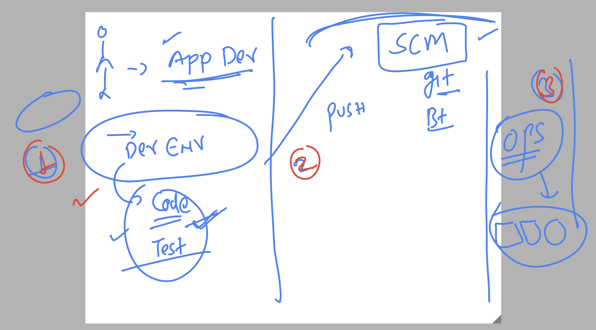
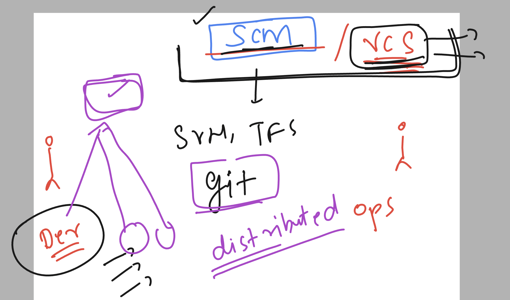

## Understanding devops as problem solver 


### Understanding devops like a culture 


### using python flask based app 


## labs connecting understanding 


## testing lab reachability 

```
ping  52.203.62.85
PING 52.203.62.85 (52.203.62.85): 56 data bytes
64 bytes from 52.203.62.85: icmp_seq=0 ttl=117 time=280.362 ms
64 bytes from 52.203.62.85: icmp_seq=1 ttl=117 time=279.737 ms
```

### connecting jump server from windows machine using SSh 

```
PS C:\Users\humanfirmware> ssh   ashu@52.203.62.85
The authenticity of host '52.203.62.85 (52.203.62.85)' can't be established.
ED25519 key fingerprint is SHA256:w6aOK2/sBPzfkK4hFXf8EZcUiDeHfcRogk5rwRXmFh4.
This key is not known by any other names
Are you sure you want to continue connecting (yes/no/[fingerprint])? yes
Warning: Permanently added '52.203.62.85' (ED25519) to the list of known hosts.
ashu@52.203.62.85's password:
   ,     #_
   ~\_  ####_        Amazon Linux 2023
  ~~  \_#####\
  ~~     \###|
  ~~       \#/ ___   https://aws.amazon.com/linux/amazon-linux-2023
   ~~       V~' '->
    ~~~         /
      ~~._.   _/
         _/ _/
       _/m/'
[ashu@ip-172-31-29-58 ~]$
[ashu@ip-172-31-29-58 ~]$
[ashu@ip-172-31-29-58 ~]$ whoami
ashu
[ashu@ip-172-31-29-58 ~]$

```


### youtube for installing vscode plugin 

[click_here](https://www.youtube.com/watch?v=2M_50-VAUJA)


### on Remote jump server creating directory structure 

```
[ashu@ip-172-31-29-58 ~]$ mkdir  ashu-devsecops 
[ashu@ip-172-31-29-58 ~]$ mkdir  ashu-devsecops/ashu-python-webapp
[ashu@ip-172-31-29-58 ~]$ mkdir  ashu-devsecops/ashu-java-webapp
[ashu@ip-172-31-29-58 ~]$ ls
ashu-devsecops
[ashu@ip-172-31-29-58 ~]$ ls  ashu-devsecops/
ashu-java-webapp  ashu-python-webapp
[ashu@ip-172-31-29-58 ~]$ 


```

### Understanding local development env 



### PYthon flask based structure 

```
tree  ashu-python-webapp/
ashu-python-webapp/
├── ashu.py
├── static
│   └── style.css
└── templates
    ├── about.html
    ├── contact.html
    └── index.html

```

### running python app 

```
[ashu@ip-172-31-29-58 ashu-devsecops]$ ls
ashu-java-webapp  ashu-python-webapp
[ashu@ip-172-31-29-58 ashu-devsecops]$ cd ashu-python-webapp/
[ashu@ip-172-31-29-58 ashu-python-webapp]$ ls
ashu.py  static  templates
[ashu@ip-172-31-29-58 ashu-python-webapp]$ python3 ashu.py 
 * Serving Flask app 'ashu'
 * Debug mode: on
WARNING: This is a development server. Do not use it in a production deployment. Use a production WSGI server instead.
 * Running on all addresses (0.0.0.0)
 * Running on http://127.0.0.1:5000
 * Running on http://172.31.29.58:5000
Press CTRL+C to quit
 * Restarting with stat
 * Debugger is active!
 * Debugger PIN: 137-732-852

```

## Understanding SCM and VCS 



### git overview 


