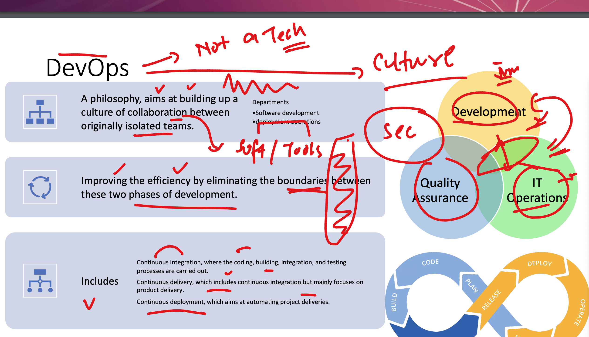
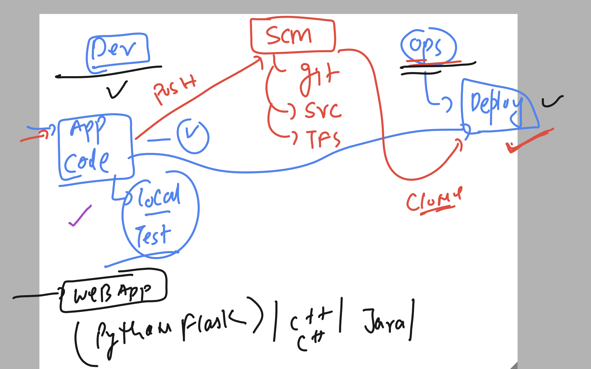

## Understanding devops as problem solver 


### Understanding devops like a culture 



### using python flask based app 



## labs connecting understanding 


## testing lab reachability 

```
ping  52.203.62.85
PING 52.203.62.85 (52.203.62.85): 56 data bytes
64 bytes from 52.203.62.85: icmp_seq=0 ttl=117 time=280.362 ms
64 bytes from 52.203.62.85: icmp_seq=1 ttl=117 time=279.737 ms
```

### connecting jump server from windows machine using SSh 

```
PS C:\Users\humanfirmware> ssh   ashu@52.203.62.85
The authenticity of host '52.203.62.85 (52.203.62.85)' can't be established.
ED25519 key fingerprint is SHA256:w6aOK2/sBPzfkK4hFXf8EZcUiDeHfcRogk5rwRXmFh4.
This key is not known by any other names
Are you sure you want to continue connecting (yes/no/[fingerprint])? yes
Warning: Permanently added '52.203.62.85' (ED25519) to the list of known hosts.
ashu@52.203.62.85's password:
   ,     #_
   ~\_  ####_        Amazon Linux 2023
  ~~  \_#####\
  ~~     \###|
  ~~       \#/ ___   https://aws.amazon.com/linux/amazon-linux-2023
   ~~       V~' '->
    ~~~         /
      ~~._.   _/
         _/ _/
       _/m/'
[ashu@ip-172-31-29-58 ~]$
[ashu@ip-172-31-29-58 ~]$
[ashu@ip-172-31-29-58 ~]$ whoami
ashu
[ashu@ip-172-31-29-58 ~]$

```


### youtube for installing vscode plugin 

[click_here](https://www.youtube.com/watch?v=2M_50-VAUJA)

