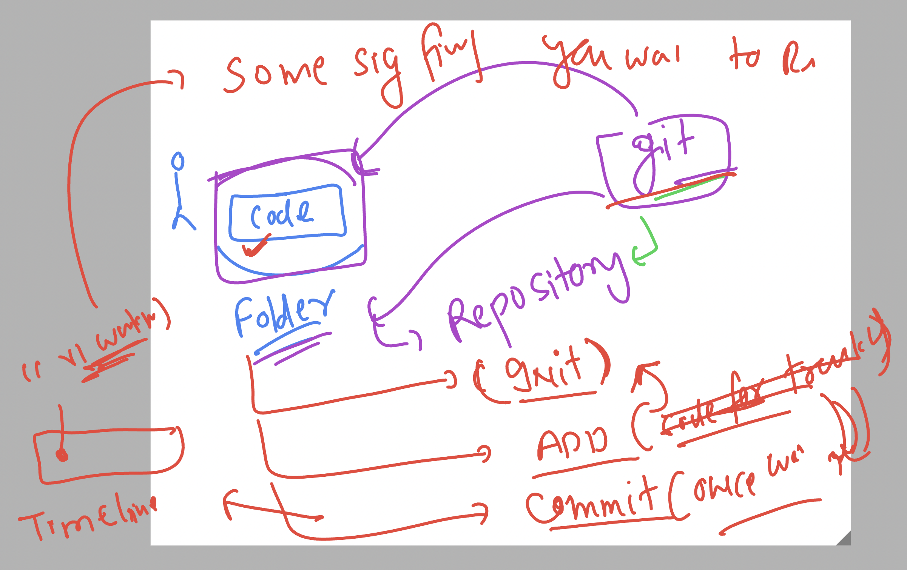
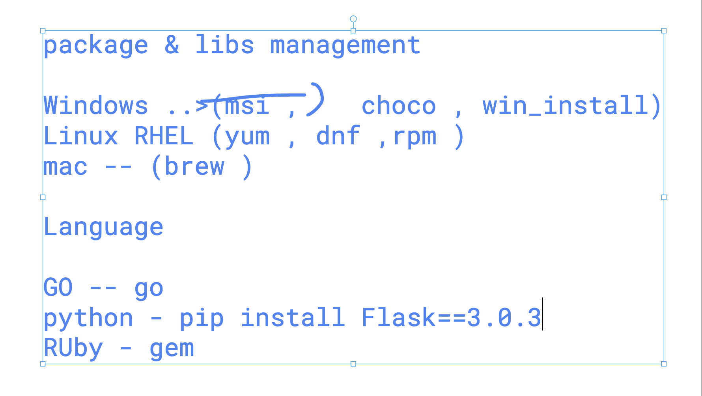

## Understanding devops as problem solver 


### Understanding devops like a culture 


### using python flask based app 


## labs connecting understanding 


## testing lab reachability 

```
ping  52.203.62.85
PING 52.203.62.85 (52.203.62.85): 56 data bytes
64 bytes from 52.203.62.85: icmp_seq=0 ttl=117 time=280.362 ms
64 bytes from 52.203.62.85: icmp_seq=1 ttl=117 time=279.737 ms
```

### connecting jump server from windows machine using SSh 

```
PS C:\Users\humanfirmware> ssh   ashu@52.203.62.85
The authenticity of host '52.203.62.85 (52.203.62.85)' can't be established.
ED25519 key fingerprint is SHA256:w6aOK2/sBPzfkK4hFXf8EZcUiDeHfcRogk5rwRXmFh4.
This key is not known by any other names
Are you sure you want to continue connecting (yes/no/[fingerprint])? yes
Warning: Permanently added '52.203.62.85' (ED25519) to the list of known hosts.
ashu@52.203.62.85's password:
   ,     #_
   ~\_  ####_        Amazon Linux 2023
  ~~  \_#####\
  ~~     \###|
  ~~       \#/ ___   https://aws.amazon.com/linux/amazon-linux-2023
   ~~       V~' '->
    ~~~         /
      ~~._.   _/
         _/ _/
       _/m/'
[ashu@ip-172-31-29-58 ~]$
[ashu@ip-172-31-29-58 ~]$
[ashu@ip-172-31-29-58 ~]$ whoami
ashu
[ashu@ip-172-31-29-58 ~]$

```


### youtube for installing vscode plugin 

[click_here](https://www.youtube.com/watch?v=2M_50-VAUJA)


### on Remote jump server creating directory structure 

```
[ashu@ip-172-31-29-58 ~]$ mkdir  ashu-devsecops 
[ashu@ip-172-31-29-58 ~]$ mkdir  ashu-devsecops/ashu-python-webapp
[ashu@ip-172-31-29-58 ~]$ mkdir  ashu-devsecops/ashu-java-webapp
[ashu@ip-172-31-29-58 ~]$ ls
ashu-devsecops
[ashu@ip-172-31-29-58 ~]$ ls  ashu-devsecops/
ashu-java-webapp  ashu-python-webapp
[ashu@ip-172-31-29-58 ~]$ 


```

### Understanding local development env 


### PYthon flask based structure 

```
tree  ashu-python-webapp/
ashu-python-webapp/
├── ashu.py
├── static
│   └── style.css
└── templates
    ├── about.html
    ├── contact.html
    └── index.html

```

### running python app 

```
[ashu@ip-172-31-29-58 ashu-devsecops]$ ls
ashu-java-webapp  ashu-python-webapp
[ashu@ip-172-31-29-58 ashu-devsecops]$ cd ashu-python-webapp/
[ashu@ip-172-31-29-58 ashu-python-webapp]$ ls
ashu.py  static  templates
[ashu@ip-172-31-29-58 ashu-python-webapp]$ python3 ashu.py 
 * Serving Flask app 'ashu'
 * Debug mode: on
WARNING: This is a development server. Do not use it in a production deployment. Use a production WSGI server instead.
 * Running on all addresses (0.0.0.0)
 * Running on http://127.0.0.1:5000
 * Running on http://172.31.29.58:5000
Press CTRL+C to quit
 * Restarting with stat
 * Debugger is active!
 * Debugger PIN: 137-732-852

```

## Understanding SCM and VCS 


### git overview 



### git init   (only One time job)

```
ls
ashu.py  static  templates
[ashu@ip-172-31-29-58 ashu-python-webapp]$ git init
hint: Using 'master' as the name for the initial branch. This default branch name
hint: is subject to change. To configure the initial branch name to use in all
hint: of your new repositories, which will suppress this warning, call:
hint: 
hint:   git config --global init.defaultBranch <name>
hint: 
hint: Names commonly chosen instead of 'master' are 'main', 'trunk' and
hint: 'development'. The just-created branch can be renamed via this command:
hint: 
hint:   git branch -m <name>
Initialized empty Git repository in /home/ashu/ashu-devsecops/ashu-python-webapp/.git/
[ashu@ip-172-31-29-58 ashu-python-webapp]$ ls  -a
.  ..  .git  ashu.py  static  templates
[ashu@ip-172-31-29-58 ashu-python-webapp]$ ls .git/
HEAD  branches  config  description  hooks  info  objects  refs
[ashu@ip-172-31-29-58 ashu-python-webapp]$ 
```

### git add 

```
ls 
ashu.py  static  templates
[ashu@ip-172-31-29-58 ashu-python-webapp]$ git add  .
[ashu@ip-172-31-29-58 ashu-python-webapp]$ 

```

### git commit -- (take snapshot of current code and remember this time as well)


```
 git commit  -m "python app1 works"
Author identity unknown

*** Please tell me who you are.

Run

  git config --global user.email "you@example.com"
  git config --global user.name "Your Name"

to set your account's default identity.
Omit --global to set the identity only in this repository.

fatal: empty ident name (for <ashu@ip-172-31-29-58.ec2.internal>) not allowed
```

## Git using github host platform 


## git operations 

### clone 


```
 git  clone https://github.com/redashu/unisys_devsecops.git
Cloning into 'unisys_devsecops'...
remote: Enumerating objects: 3, done.
remote: Counting objects: 100% (3/3), done.
remote: Total 3 (delta 0), reused 0 (delta 0), pack-reused 0 (from 0)
Receiving objects: 100% (3/3), done.
[ashu@ip-172-31-29-58 ashu-devsecops]$ ls
ashu-java-webapp  ashu-python-webapp  unisys_devsecops
```


### copy code to git repo 

```
[ashu@ip-172-31-29-58 ashu-devsecops]$ ls
ashu-java-webapp  ashu-python-webapp  unisys_devsecops
[ashu@ip-172-31-29-58 ashu-devsecops]$ 
[ashu@ip-172-31-29-58 ashu-devsecops]$ 
[ashu@ip-172-31-29-58 ashu-devsecops]$ ls  ashu-python-webapp/
ashu.py  static  templates

[ashu@ip-172-31-29-58 ashu-devsecops]$ cp ashu-python-webapp/ashu.py  unisys_devsecops/
[ashu@ip-172-31-29-58 ashu-devsecops]$ 

[ashu@ip-172-31-29-58 ashu-devsecops]$ cp -r ashu-python-webapp/static/  unisys_devsecops/

[ashu@ip-172-31-29-58 ashu-devsecops]$ cp -r ashu-python-webapp/templates/  unisys_devsecops/

```


## to push the code to remote git repo 


### commiting for the first time 

```
  41  cd unisys_devsecops/
   42  ls
   43  git add .
   44  git commit  -m "flask  code ui version1 "

   ===> asked for details 

   45   git config --global user.email ashutoshh@linux.com
   46  git config --global user.name redashu
   ===> commited again 

[ashu@ip-172-31-29-58 unisys_devsecops]$ git commit  -m "flask  code ui version1 "
[master 273c750] flask  code ui version1
 5 files changed, 191 insertions(+)
 create mode 100644 ashu.py
 create mode 100644 static/style.css
 create mode 100644 templates/about.html
 create mode 100644 templates/contact.html
 create mode 100644 templates/index.html
[ashu@ip-172-31-29-58 unisys_devsecops]$ 
```

## using ssh method to auth and clone 

```
 ssh-keygen 
Generating public/private rsa key pair.
Enter file in which to save the key (/home/ashu/.ssh/id_rsa): 
Created directory '/home/ashu/.ssh'.
Enter passphrase (empty for no passphrase): 
Enter same passphrase again: 
Your identification has been saved in /home/ashu/.ssh/id_rsa
Your public key has been saved in /home/ashu/.ssh/id_rsa.pub
The key fingerprint is:
SHA256:KbmT2FX0HfREyNjARVX98ffosHus6t+GRuobfR8MPq4 ashu@ip-172-31-29-58.ec2.internal
The key's randomart image is:
+---[RSA 3072]----+
|          ...O=+B|
|         . .o.+=.|
|          . . . =|
|       . o      +|
|      o S    . .o|
|     o =   .+ + .|
|    . =   .o.O.o |
|       .  ..=o*..|
|         o=E=*. .|
+----[SHA256]-----+
```

### copy public key data and upload to github account 

```
 cat /home/ashu/.ssh/id_rsa.pub
 ssh-rsa AAAAB3NzaC1yc2EAAAADAQABAAABgQCageNtc9A5pfWE4lZeQoQnON8ZTE1iHlZJ/3e1SqQHL6pFrK6IXA3JTld1mOelh24mMy80BKhODLGcYoIx97fIopmtoaPXiEGch0EXAOduLls
```

### push code after clone and copy data 

```

 rm -rf unisys_devsecops/
 git clone git@github.com:redashu/unisys_devsecops.git
 cp -r ashu-python-webapp/ashu.py  unisys_devsecops/
 cp -r ashu-python-webapp/static  unisys_devsecops/
 cp -r ashu-python-webapp/templates/  unisys_devsecops/

 ==>
 cd unisys_devsecops/

git add .
[ashu@ip-172-31-29-58 unisys_devsecops]$ git commit  -m "first code "
[master 6b4c7af] first code
 5 files changed, 191 insertions(+)
 create mode 100644 ashu.py
 create mode 100644 static/style.css
 create mode 100644 templates/about.html
 create mode 100644 templates/contact.html
 create mode 100644 templates/index.html


[ashu@ip-172-31-29-58 unisys_devsecops]$ git push 
Enumerating objects: 10, done.
Counting objects: 100% (10/10), done.
Delta compression using up to 4 threads
Compressing objects: 100% (8/8), done.
Writing objects: 100% (9/9), 2.43 KiB | 2.43 MiB/s, done.
Total 9 (delta 1), reused 0 (delta 0), pack-reused 0
remote: Resolving deltas: 100% (1/1), done.
To github.com:redashu/unisys_devsecops.git
   d17f479..6b4c7af  master -> master
```

### Deploy python flask app in Raw machine 

## login with root user  in (Redhat Enterprise Linux)

```
sudo -i
[root@ip-172-31-93-147 ~]# whoami
root
[root@ip-172-31-93-147 ~]# 


===> Installing python3.9 

yum install python3.9
Last metadata expiration check: 0:10:07 ago on Mon Sep 30 10:14:29 2024.
Package python3-3.9.16-1.amzn2023.0.9.x86_64 is already installed.
Dependencies resolved.
Nothing to do.
Complete!

===> Installing flask 3.0.3 version 

 pip install Flask==3.0.3


Collecting Flask==3.0.3
  Downloading flask-3.0.3-py3-none-any.whl (101 kB)
     |████████████████████████████████| 101 kB 4.1 MB/s            
Collecting click>=8.1.3
  Downloading click-8.1.7-py3-none-any.whl (97 kB)
     |████████████████████████████████| 97 kB 6.1 MB/s             
Collecting blinker>=1.6.2
```

### Installers in Tech  In case pip is not there in then 



## Install PIp 

```
yum install python3-pip 
Last metadata expiration check: 0:16:35 ago on Mon Sep 30 10:14:29 2024.
Dependencies resolved.
=========================================================================================================================================================
 Package                                Architecture                 Version                                     Repository                         Size
=========================================================================================================================================================
Installing:
 python3-pip                            noarch                       21.3.1-2.amzn2023.0.7                       amazonlinux                       1.8 M
Installing weak dependencies:
 libxcrypt-compat                       x86_64                       4.4.33-7.amzn2023                           amazonlinux                        92 k

Transaction Summary
=========================================================================================================================================================
Install  2 Packages

Total download size: 1.9 M
Installed size: 11 M
Is this ok [y/N]: y
Downloading Packages:
(1/2): python3-pip-21.3.1-2.amzn2023.0.7.noarch.rpm                                                                       18 MB/s | 1.8 MB     00:00    
(2/2): libxcrypt-compat-4.4.33-7.amzn2023.x86_64.rpm                                                                     859 kB/s |  92 kB     00:00    
---------------------------------------------------------------------------------------------------------------------------------------------------------
Total                                                                                                                    9.9 MB/s | 1.9 MB     00:00     
Running transaction check
Transaction check succeeded.
Running transaction test
Transaction test succeeded.
Running transaction
  Preparing        :                                                                                                                                 1/1 
  Installing       : libxcrypt-compat-4.4.33-7.amzn2023.x86_64                                                                                       1/2 
  Installing       : python3-pip-21.3.1-2.amzn2023.0.7.noarch                                                                                        2/2 
  Running scriptlet: python3-pip-21.3.1-2.amzn2023.0.7.noarch                                                                                        2/2 
  Verifying        : libxcrypt-compat-4.4.33-7.amzn2023.x86_64                                                                                       1/2 
  Verifying        : python3-pip-21.3.1-2.amzn2023.0.7.noarch                                                                                        2/2 

Installed:
  libxcrypt-compat-4.4.33-7.amzn2023.x86_64                                   python3-pip-21.3.1-2.amzn2023.0.7.noarch                                  

Complete!

```

