## DevsecOps 

### Revision 

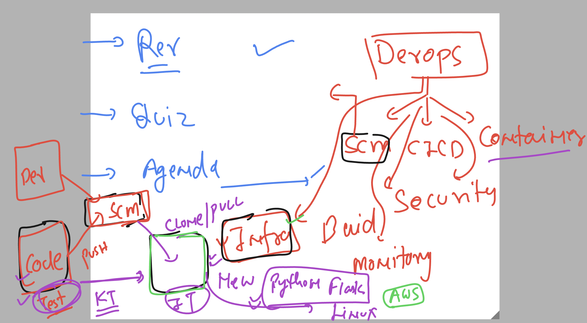

### Understanding app deployment / testing Infra 

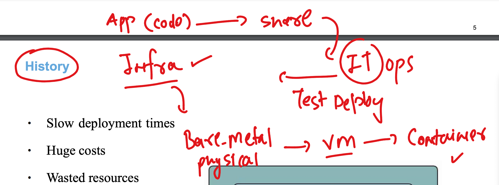

### app Incompatibiity was a really big issues 

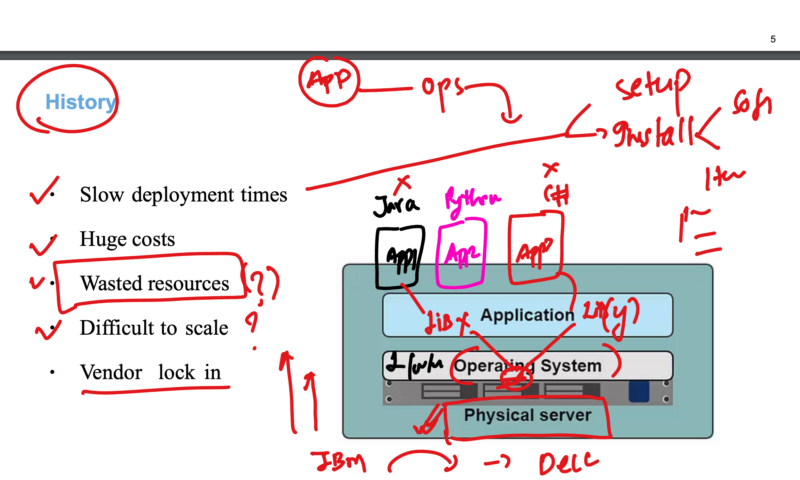

### introduing vm concept to run multiple apps on single physical infra 

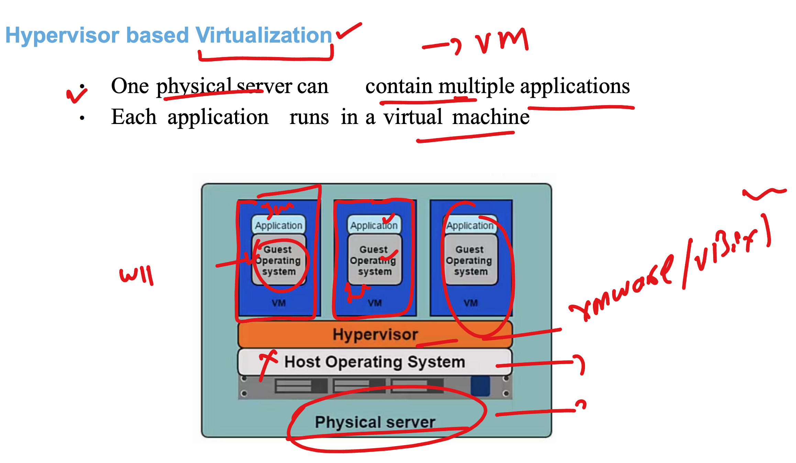

## Problems with Vm 

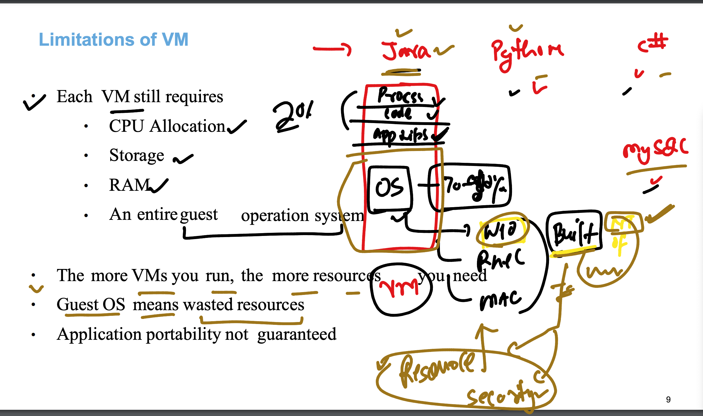

## VM vs Containers 

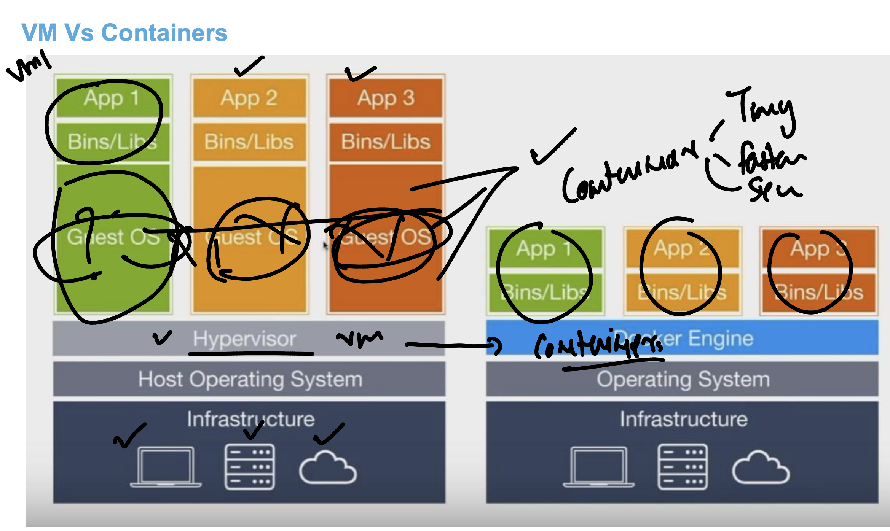

## Container tech is using Host OS to hanlde containers and apps running inside it 

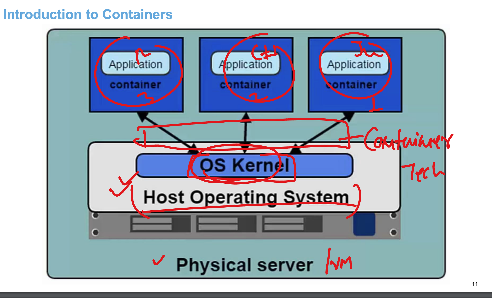

### Container runtimes 

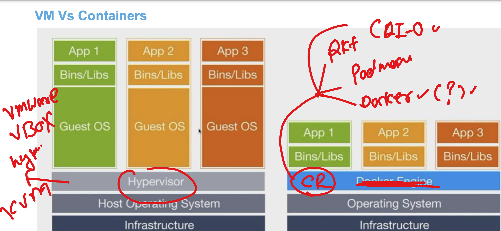


## Docker Understanding 

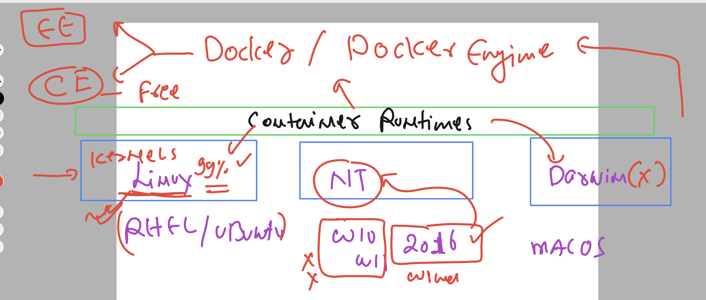

### Docker infra understanding 

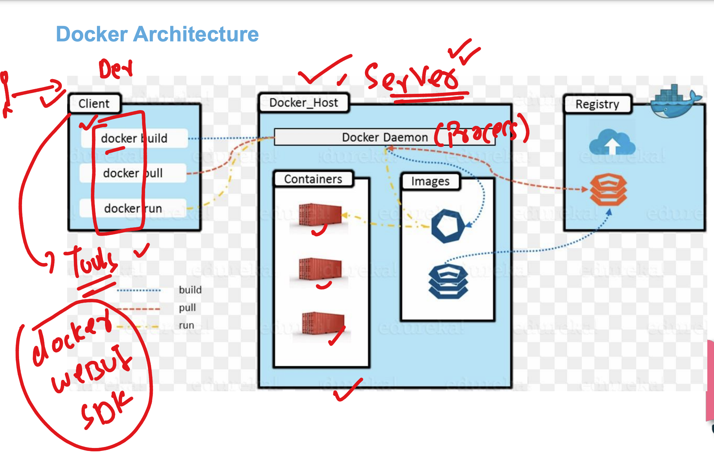


## Note: to setup docker in RHEL linux 

```
yum install docker 
Last metadata expiration check: 1 day, 2:53:36 ago on Mon Sep 30 02:35:08 2024.
Package docker-25.0.6-1.amzn2023.0.2.x86_64 is already installed.
Dependencies resolved.
Nothing to do.
Complete!

====>
[root@ip-172-31-28-115 ~]# systemctl start docker 
[root@ip-172-31-28-115 ~]# systemctl status  docker 

● docker.service - Docker Application Container Engine
     Loaded: loaded (/usr/lib/systemd/system/docker.service; enabled; preset: disabled)
     Active: active (running) since Tue 2024-10-01 04:33:39 UTC; 55min ago
TriggeredBy: ● docker.socket
       Docs: https://docs.docker.com
```

## Understanding docker client and server connect process

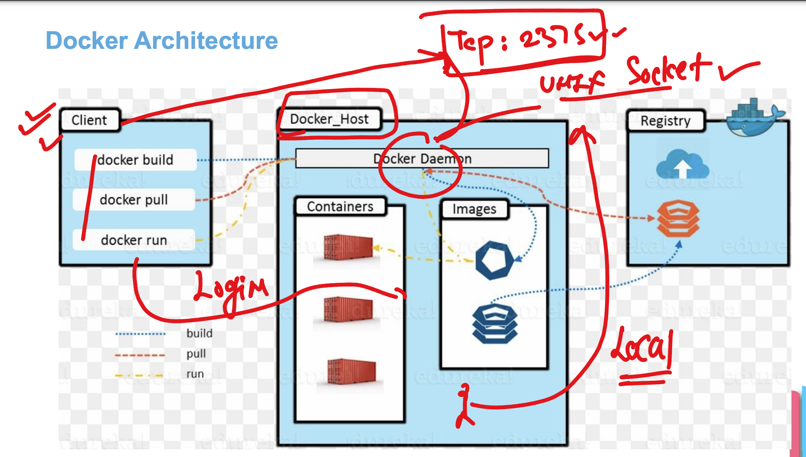


### checking docker client to server connection 

```
 docker  context  ls
NAME        DESCRIPTION                               DOCKER ENDPOINT               ERROR
default *   Current DOCKER_HOST based configuration   unix:///var/run/docker.sock   
[ashu@ip-172-31-29-58 ashu-devsecops]$ 


```

### creating remote context to connect docker client to remote server

```
docker context  create ashu-remote --docker  host="tcp://172.31.28.115:2375"

===>
 docker  context  ls
NAME          DESCRIPTION                               DOCKER ENDPOINT               ERROR
ashu-remote                                             tcp://172.31.28.115:2375      
default *     Current DOCKER_HOST based configuration   unix:///var/run/docker.sock  

===>>
 docker context use ashu-remote
ashu-remote
Current context is now "ashu-remote"

===>

docker  context  ls
NAME            DESCRIPTION                               DOCKER ENDPOINT               ERROR
ashu-remote *                                             tcp://172.31.28.115:2375      
default         Current DOCKER_HOST based configuration   unix:///var/run/docker.sock

```

## App containerization 

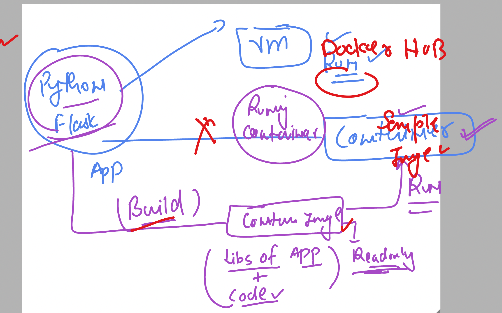

## Docker basic operations 

### listing images

```
docker  images
REPOSITORY   TAG       IMAGE ID   CREATED   SIZE
[ashu@ip-172-31-29-58 ashu-devsecops]$ 

```

### pulling image from docker hub 

```
 docker pull mysql 
Using default tag: latest
latest: Pulling from library/mysql
eba3c26198b7: Pull complete 
fc6c33853069: Pull complete 
f1fa3ee22bea: Pull complete 
5b8b24615ae8: Pull complete 
cded0449fb1a: Pull complete 
095378692b4a: Pull complete 
110d87e5d2a3: Pull complete 
bd1dbbbda514: Pull complete 
982f92841ea3: Pull complete 
de34c1fda3aa: Pull complete 
Digest: sha256:92dc869678019f65d761155dacac660a904f6245bfe1b7997da0a73b2bfc68c9
Status: Downloaded newer image for mysql:latest
docker.io/library/mysql:latest
```

### pulling a particular version based image 

```
 docker pull python:3.9-slim
3.9-slim: Pulling from library/python
302e3ee49805: Already exists 
4c0965d39195: Pull complete 
fdeeec85abba: Pull complete 
62a08b8dd4f5: Pull complete 
Digest: sha256:49f94609e5a997dc16086a66ac9664591854031d48e375945a9dbf4d1d53abbc
Status: Downloaded newer image for python:3.9-slim
docker.io/library/python:3.9-slim
[ashu@ip-172-31-29-58 ashu-devsecops]$ docker  images
REPOSITORY   TAG        IMAGE ID       CREATED         SIZE
postgres     latest     f0dfc903a663   4 days ago      434MB
mongo        latest     4d441da0b855   12 days ago     861MB
python       latest     d702a66b1e28   3 weeks ago     1.01GB
python       3.9-slim   9d8cb7037cd8   3 weeks ago     125MB
alpine       latest     91ef0af61f39   3 weeks ago     7.8MB
nginx        latest     9527c0f683c3   6 weeks ago     188MB
mysql        latest     c757d623b190   2 months ago    586MB
busybox      latest     6fd955f66c23   16 months ago   4.26MB
[ashu@ip-172-31-29-58 ashu-devsecops]$ 

```
### life of container 

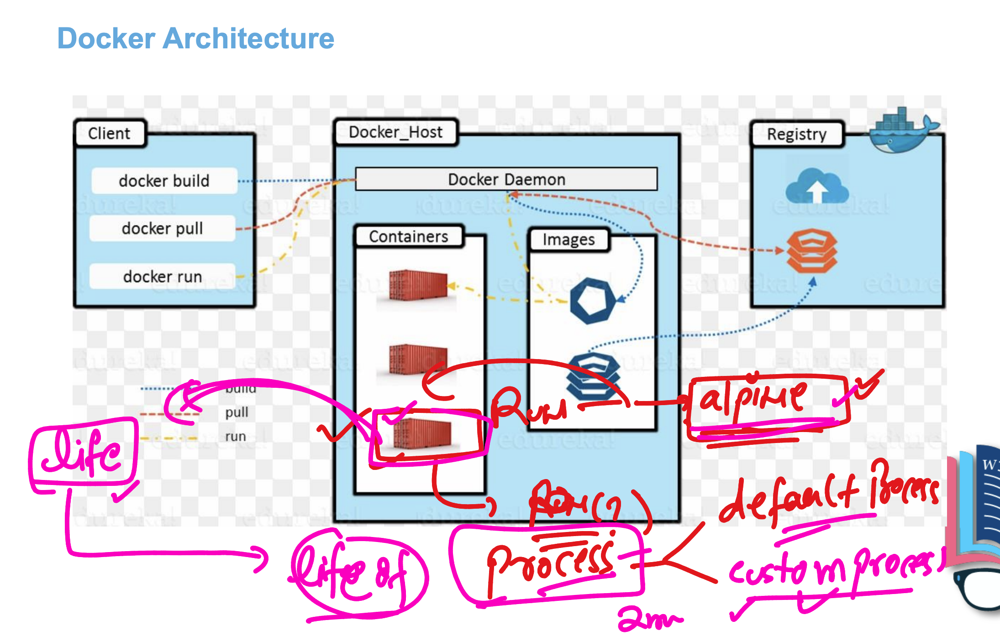


### creating container using image 

```
docker  run  --name  ashuc1  -d -it  alpine:latest
c55823529d04c5ead49428859d0ae3c24fc23bc6aac93c472780846cbc11b3cd

===>

[ashu@ip-172-31-29-58 ashu-devsecops]$ docker  ps
CONTAINER ID   IMAGE            COMMAND     CREATED          STATUS          PORTS     NAMES
c55823529d04   alpine:latest    "/bin/sh"   3 seconds ago    Up 3 seconds              ashuc1
928c9a70a95c   busybox          "sh"        4 seconds ago    Up 4 seconds              NarayanC1
e8a017b5cb5f   alpine:latest    "/bin/sh"   16 seconds ago   Up 15 seconds             pradeepa
42c373f6e561   busybox:latest   "sh"        16 seconds ago   Up 15 seconds             cbs
6f2c063aed5e   python:latest    "python3"   25 seconds ago   Up 24 seconds             muskanc1
[ashu@ip-172-31-29-58 ashu-devsecops]$ 

```

### resource used by container 

```
[ashu@ip-172-31-29-58 ashu-devsecops]$ docker   stats  ashuc1 
CONTAINER ID   NAME      CPU %     MEM USAGE / LIMIT   MEM %     NET I/O     BLOCK I/O   PIDS
c55823529d04   ashuc1    0.00%     504KiB / 15.61GiB   0.00%     866B / 0B   0B / 0B     1
^C

```

### stopping container 

```
docker   stop  ashuc1


```

### list all the containers (non running as well)


```
docker   ps -a
```
### starting it again 

```
docker   start  ashuc1
ashuc1
[ashu@ip-172-31-29-58 ashu-devsecops]$ docker ps
CONTAINER ID   IMAGE           COMMAND                  CREATED         STATUS         PORTS                                           NAMES
0439938e5a59   mongo           "docker-entrypoint.s…"   3 minutes ago   Up 3 minutes   0.0.0.0:27017->27017/tcp, :::27017->27017/tcp   ud-mongo
65736aef215c   busybox         "sh"                     3 minutes ago   Up 3 minutes                                                   vl3
baa6eadfb49a   nginx:latest    "/docker-entrypoint.…"   4 minutes ago   Up 4 minutes   80/tcp                                          pandic1
4dca0206a188   python:latest   "python3"                4 minutes ago   Up 4 minutes                                                   sujan
fc39d159cfcc   mongo:latest    "docker-entrypoint.s…"   4 minutes ago   Up 4 minutes   27017/tcp                                       chrp1
7fa342d27260   python:latest   "python3"                5 minutes ago   Up 5 minutes                                                   bbcont1
c55823529d04   alpine:latest   "/bin/sh"                6 minutes ago   Up 5 seconds                                                   ashuc1
e8a017b5cb5f   alpine:latest   "/bin/sh"                6 minutes ago   Up 6 minutes                                                   pradeepa
```

### removing container 

```
[ashu@ip-172-31-29-58 ashu-devsecops]$ docker  stop ashuc1
ashuc1

[ashu@ip-172-31-29-58 ashu-devsecops]$ docker  rm  ashuc1
ashuc1
```

## creating custom app docker images using build tools 

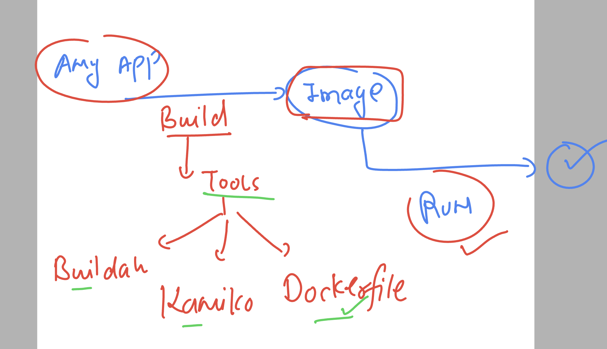

### python flask webapp containerization 

### use code + Dockerfile + .dockeringore 

```
===> .dockerignore

Dockerfile
.git
README.md
.dockerignore

====> Dockerfile 

FROM python:3.9-slim 
# it can use an existing image or can pull from docker hub 
LABEL name=ashutoshh
LABEL email=ashutoshh@linux.com 
# optional but you can share your contact details to other teams
RUN  pip install Flask==3.0.3 
# to make any changes in existing image like installing software etc
RUN  mkdir  /opt/ashuwebapp 
COPY  .   /opt/ashuwebapp/ 
# created a directory and copied code 
# copy will be checking .dockerignore file is exists
WORKDIR /opt/ashuwebapp/ 
# changing current location like cd command 
CMD ["python","ashu.py"]
# to choose default process which can be replace by user while container creation  
```

### Building container image using dockerfile 

```
 ls 
ashu-java-webapp  ashu-python-webapp  unisys_devsecops

[ashu@ip-172-31-29-58 ashu-devsecops]$ docker build  -t  ashuflask:appv1  unisys_devsecops/

[+] Building 5.4s (10/10) FINISHED                                                                                                docker:ashu-remote
 => [internal] load build definition from Dockerfile                                                                                            0.0s
 => => transferring dockerfile: 727B                                                                                                            0.0s
 => [internal] load metadata for docker.io/library/python:3.9-slim                                                                              0.0s
 => [internal] load .dockerignore                                                                                                               0.0s
 => => transferring context: 138B                                                                                                               0.0s
 => [1/5] FROM docker.io/library/python:3.9-slim                                                                                                0.1s
 => [internal] load build context                                                                                                               0.1s
 => => transferring context: 5.50kB                                                                                                             0.0s
 => [2/5] RUN  pip install Flask==3.0.3                                                                                                         4.2s
 => [3/5] RUN  mkdir  /opt/ashuwebapp                                                                                                           0.6s 
 => [4/5] COPY  .   /opt/ashuwebapp/                                                                                                            0.1s 
 => [5/5] WORKDIR /opt/ashuwebapp/                                                                                                              0.0s 
 => exporting to image                                                                                                                          0.2s 
 => => exporting layers                                                                                                                         0.2s 
 => => writing image sha256:f600bdf0d7fd224504b079cd08adc4df5011c0e4c7063b9c41336eed1f65588a                                                    0.0s 
 => => naming to docker.io/library/ashuflask:appv1                                                                                              0.0s
[ashu@ip-172-31-29-58 ashu-devsecops]$ 

```

### verify images 

```
docker  images
REPOSITORY   TAG        IMAGE ID       CREATED                  SIZE
bbflask      appv1      15f80d35a262   Less than a second ago   137MB
mohanflask   appv1      1e14b51f78f4   15 seconds ago           137MB
pandiflask   appv1      885def5b3738   25 seconds ago           137MB
tanflask     appv1      08a2c7224695   27 seconds ago           1.03GB
cbsflask     sppv1      d7e63fb7b8cd   28 seconds ago           1.03GB
ashuflask    appv1      f600bdf0d7fd   33 seconds ago           137MB
```