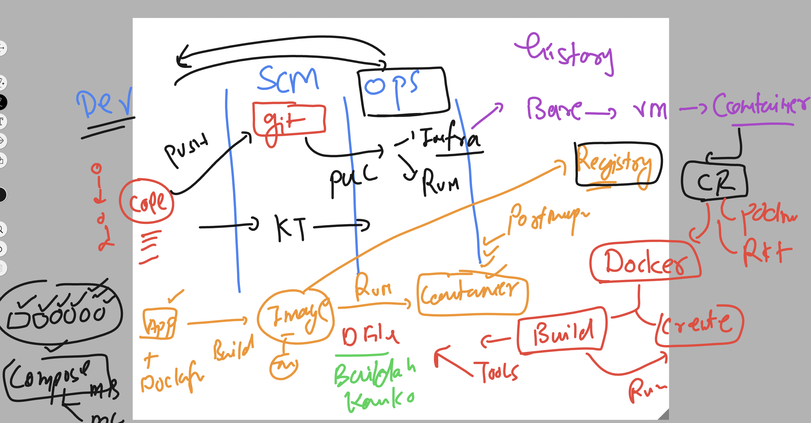

## Revision 



## for Flask and Mysql app we are creating a new repo  and cloning it to dev server

```
git clone git@github.com:redashu/ashu_unisys_flaskMysql.git
Cloning into 'ashu_unisys_flaskMysql'...
remote: Enumerating objects: 3, done.
remote: Counting objects: 100% (3/3), done.
remote: Total 3 (delta 0), reused 0 (delta 0), pack-reused 0 (from 0)
Receiving objects: 100% (3/3), done.

[ashu@ip-172-31-29-58 ashu-devsecops]$ ls
ashu-java-webapp  ashu-python-webapp  ashu_unisys_flaskMysql  unisys_devsecops
[ashu@ip-172-31-29-58 ashu-devsecops]$ 


```

### after cloning all structure look like 

```
ls
ashu-java-webapp  ashu-python-webapp  ashu_unisys_flaskMysql  unisys_devsecops
[ashu@ip-172-31-29-58 ashu-devsecops]$ 
[ashu@ip-172-31-29-58 ashu-devsecops]$ ls  ashu_unisys_flaskMysql/
Dockerfile  README.md  app.py  compose.yaml  requirements.txt  templates
[ashu@ip-172-31-29-58 ashu-devsecops]$ 
[ashu@ip-172-31-29-58 ashu-devsecops]$ 
[ashu@ip-172-31-29-58 ashu-devsecops]$ tree ashu_unisys_flaskMysql/
ashu_unisys_flaskMysql/
├── Dockerfile
├── README.md
├── app.py
├── compose.yaml
├── requirements.txt
└── templates
    ├── index.html
    └── success.html

1 directory, 7 files

```

### creating mysql database server using container 

```
docker  run -itd --name ashudb -e MYSQL_ROOT_PASSWORD=Hello@123  mysql 

Unable to find image 'mysql:latest' locally
latest: Pulling from library/mysql
eba3c26198b7: Pull complete 
fc6c33853069: Pull complete 
f1fa3ee22bea: Pull complete 
5b8b24615ae8: Pull complete 
cded0449fb1a: Pull complete 
095378692b4a: Pull complete 
110d87e5d2a3: Pull complete 
bd1dbbbda514: Pull complete 
982f92841ea3: Pull complete 
de34c1fda3aa: Pull complete 
Digest: sha256:92dc869678019f65d761155dacac660a904f6245bfe1b7997da0a73b2bfc68c9
Status: Downloaded newer image for mysql:latest
e6f567110774e1390e3d5f41a203a7c623481a466e6849c0e293754d508aa310

[ashu@ip-172-31-29-58 ashu-devsecops]$ docker  ps
CONTAINER ID   IMAGE     COMMAND                  CREATED         STATUS         PORTS                 NAMES
e6f567110774   mysql     "docker-entrypoint.s…"   6 seconds ago   Up 2 seconds   3306/tcp, 33060/tcp   ashudb
[ashu@ip-172-31-29-58 ashu-devsecops]$ 


```

### login to container and access database 

```
 docker   exec  -it  ashudb   bash 
bash-5.1# 
bash-5.1# 
bash-5.1# mysql -u root -p
Enter password: 
Welcome to the MySQL monitor.  Commands end with ; or \g.
Your MySQL connection id is 8
Server version: 9.0.1 MySQL Community Server - GPL

Copyright (c) 2000, 2024, Oracle and/or its affiliates.

Oracle is a registered trademark of Oracle Corporation and/or its
affiliates. Other names may be trademarks of their respective
owners.

Type 'help;' or '\h' for help. Type '\c' to clear the current input statement.

mysql> 

mysql> show databases;
+--------------------+
| Database           |
+--------------------+
| information_schema |
| mysql              |
| performance_schema |
| sys                |
+--------------------+
4 rows in set (0.00 sec)

mysql> exit;
Bye
bash-5.1# exit
exit
```

