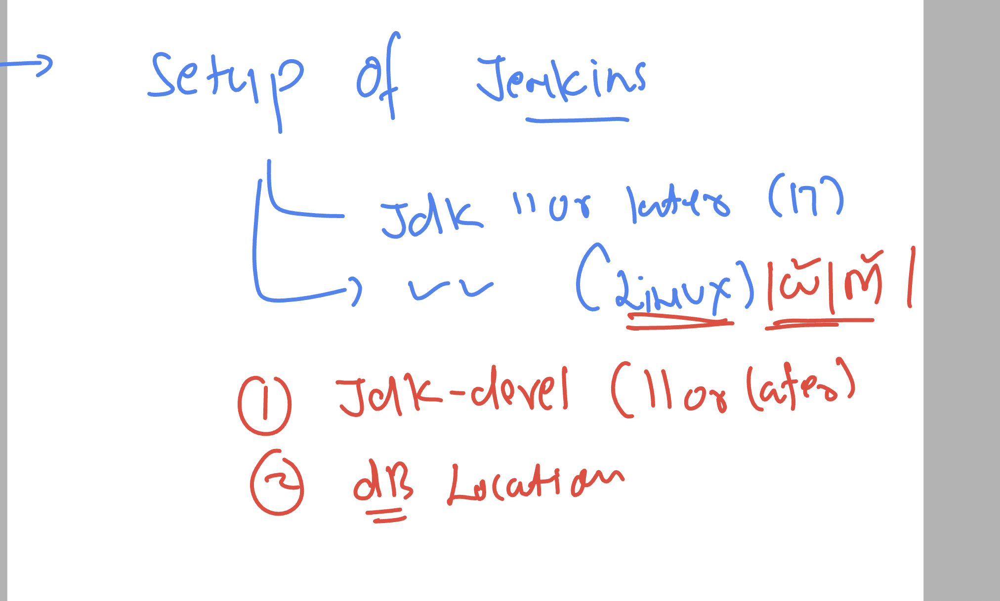
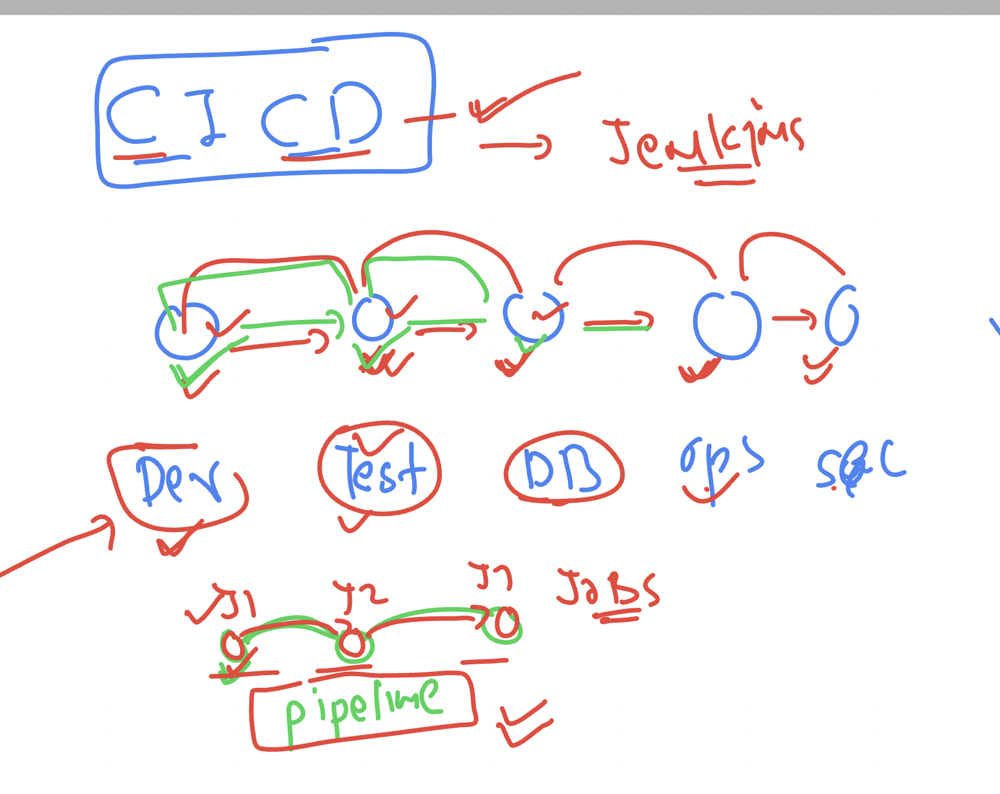
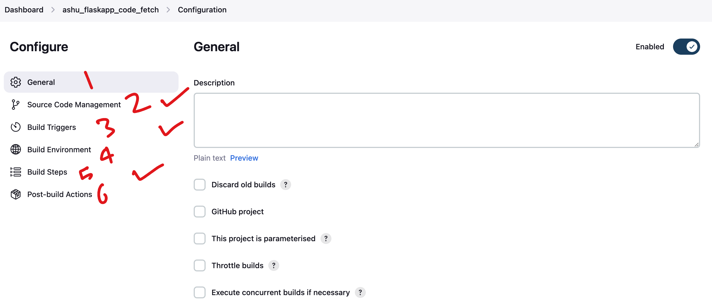
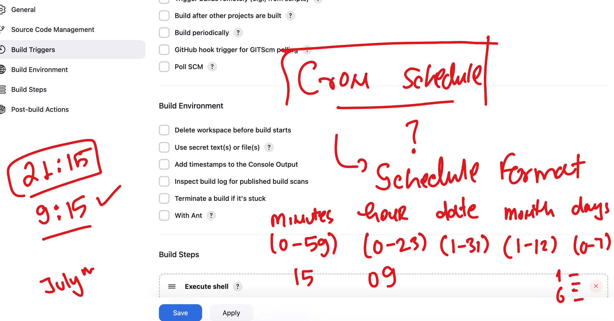
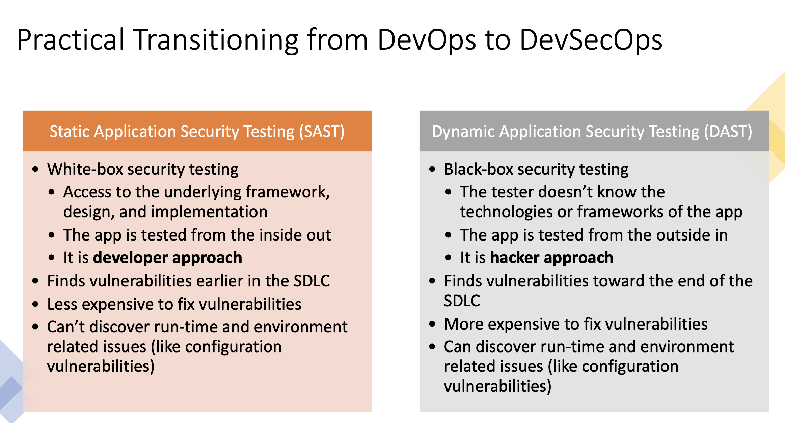
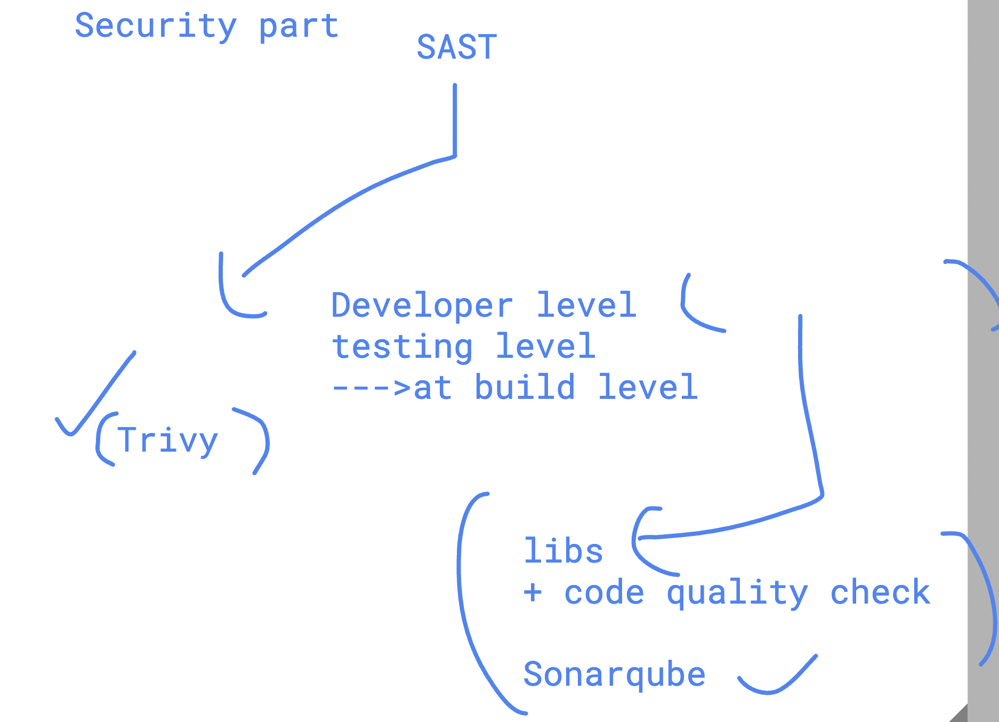
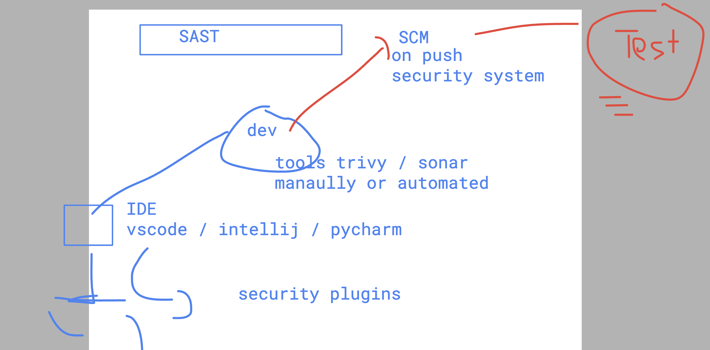
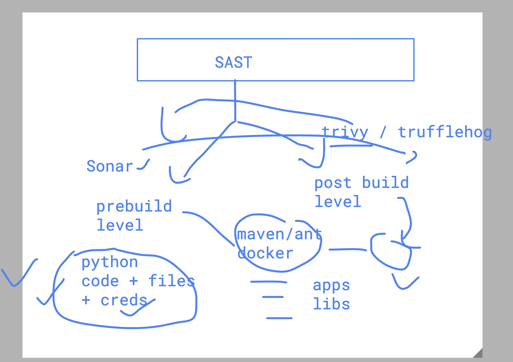
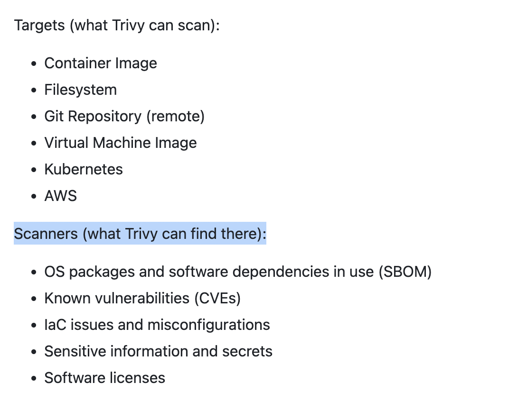

## Revision 


## for Flask and Mysql app we are creating a new repo  and cloning it to dev server

```
git clone git@github.com:redashu/ashu_unisys_flaskMysql.git
Cloning into 'ashu_unisys_flaskMysql'...
remote: Enumerating objects: 3, done.
remote: Counting objects: 100% (3/3), done.
remote: Total 3 (delta 0), reused 0 (delta 0), pack-reused 0 (from 0)
Receiving objects: 100% (3/3), done.

[ashu@ip-172-31-29-58 ashu-devsecops]$ ls
ashu-java-webapp  ashu-python-webapp  ashu_unisys_flaskMysql  unisys_devsecops
[ashu@ip-172-31-29-58 ashu-devsecops]$ 


```

### after cloning all structure look like 

```
ls
ashu-java-webapp  ashu-python-webapp  ashu_unisys_flaskMysql  unisys_devsecops
[ashu@ip-172-31-29-58 ashu-devsecops]$ 
[ashu@ip-172-31-29-58 ashu-devsecops]$ ls  ashu_unisys_flaskMysql/
Dockerfile  README.md  app.py  compose.yaml  requirements.txt  templates
[ashu@ip-172-31-29-58 ashu-devsecops]$ 
[ashu@ip-172-31-29-58 ashu-devsecops]$ 
[ashu@ip-172-31-29-58 ashu-devsecops]$ tree ashu_unisys_flaskMysql/
ashu_unisys_flaskMysql/
├── Dockerfile
├── README.md
├── app.py
├── compose.yaml
├── requirements.txt
└── templates
    ├── index.html
    └── success.html

1 directory, 7 files

```

### creating mysql database server using container 

```
docker  run -itd --name ashudb -e MYSQL_ROOT_PASSWORD=Hello@123  mysql 

Unable to find image 'mysql:latest' locally
latest: Pulling from library/mysql
eba3c26198b7: Pull complete 
fc6c33853069: Pull complete 
f1fa3ee22bea: Pull complete 
5b8b24615ae8: Pull complete 
cded0449fb1a: Pull complete 
095378692b4a: Pull complete 
110d87e5d2a3: Pull complete 
bd1dbbbda514: Pull complete 
982f92841ea3: Pull complete 
de34c1fda3aa: Pull complete 
Digest: sha256:92dc869678019f65d761155dacac660a904f6245bfe1b7997da0a73b2bfc68c9
Status: Downloaded newer image for mysql:latest
e6f567110774e1390e3d5f41a203a7c623481a466e6849c0e293754d508aa310

[ashu@ip-172-31-29-58 ashu-devsecops]$ docker  ps
CONTAINER ID   IMAGE     COMMAND                  CREATED         STATUS         PORTS                 NAMES
e6f567110774   mysql     "docker-entrypoint.s…"   6 seconds ago   Up 2 seconds   3306/tcp, 33060/tcp   ashudb
[ashu@ip-172-31-29-58 ashu-devsecops]$ 


```

### login to container and access database 

```
 docker   exec  -it  ashudb   bash 
bash-5.1# 
bash-5.1# 
bash-5.1# mysql -u root -p
Enter password: 
Welcome to the MySQL monitor.  Commands end with ; or \g.
Your MySQL connection id is 8
Server version: 9.0.1 MySQL Community Server - GPL

Copyright (c) 2000, 2024, Oracle and/or its affiliates.

Oracle is a registered trademark of Oracle Corporation and/or its
affiliates. Other names may be trademarks of their respective
owners.

Type 'help;' or '\h' for help. Type '\c' to clear the current input statement.

mysql> 

mysql> show databases;
+--------------------+
| Database           |
+--------------------+
| information_schema |
| mysql              |
| performance_schema |
| sys                |
+--------------------+
4 rows in set (0.00 sec)

mysql> exit;
Bye
bash-5.1# exit
exit
```

### Creating compsoe file for flask and mysql 

```
docker-compose  up -d --build 
WARN[0000] /home/ashu/ashu-devsecops/ashu_unisys_flaskMysql/compose.yaml: the attribute `version` is obsolete, it will be ignored, please remove it to avoid potential confusion 
[+] Running 12/12
 ✔ ashudb Pulled                                                                                                                                            9.1s 
   ✔ eba3c26198b7 Already exists                                                                                                                            0.0s 
   ✔ b6c54a7f9fe8 Pull complete                                                                                                                             0.4s 
   ✔ 972686f20d79 Pull complete                                                                                                                             0.4s 
   ✔ 48f5f58971f7 Pull complete                                                                                                                             0.7s 
   ✔ 1c3daf5de485 Pull complete                                                                                                                             0.8s 
   ✔ eba13b8088fe Pull complete                                                                                                                             0.8s 
   ✔ 514ee5d23bc9 Pull complete                                                                                                                             2.0s 
   ✔ e91f47674d25 Pull complete                                                                                                                             2.0s 
   ✔ 077dbde9e2f6 Pull complete                                                                                                                             8.8s 
   ✔ 466b47b075c4 Pull complete                                                                                                                             8.8s 
   ✔ d145be117b98 Pull complete                                                                                                                             8.8s 
[+] Building 18.1s (12/12) FINISHED                                                                                                           docker:ashu-remote
 => [ashuflaskwebapp internal] load build definition from Dockerfile                                                                                        0.0s
 => => transferring dockerfile: 625B                                                                                                                        0.0s
 => [ashuflaskwebapp internal] load metadata for docker.io/library/python:3.9-slim                                                                          0.1s
 => [ashuflaskwebapp auth] library/python:pull token for registry-1.docker.io                                                                               0.0s
 => [ashuflaskwebapp internal] load .dockerignore                                                                                                           0.0s
 => => transferring context: 153B                                                                                                                           0.0s
 => CACHED [ashuflaskwebapp 1/5] FROM docker.io/library/python:3.9-slim@sha256:49f94609e5a997dc16086a66ac9664591854031d48e375945a9dbf4d1d53abbc             0.0s
 => [ashuflaskwebapp internal] load build context                                                                                                           0.0s
 => => transferring context: 4.40kB                                                                                                                         0.0s
 => [ashuflaskwebapp 2/5] WORKDIR /app                                                                                                                      3.0s
 => [ashuflaskwebapp 3/5] COPY requirements.txt .                                                                                                           0.0s
 => [ashuflaskwebapp 4/5] RUN pip install --no-cache-dir -r requirements.txt                                                                               13.6s
 => [ashuflaskwebapp 5/5] COPY . .                                                                                                                          0.0s 
 => [ashuflaskwebapp] exporting to image                                                                                                                    1.2s 
 => => exporting layers                                                                                                                                     1.2s 
 => => writing image sha256:8535ca4ac4910abc1a3f5f8d0a23d696a91b4659f673b64465d0d61730a8bd44                                                                0.0s 
 => => naming to docker.io/library/ashuflask:webappv1                                                                                                       0.0s 
 => [ashuflaskwebapp] resolving provenance for metadata file                                                                                                0.0s 
[+] Running 3/3
 ✔ Network ashu_unisys_flaskmysql_default              Created                                                                                              0.7s 
 ✔ Container ashudbc1                                  Started                                                                                              0.9s 
 ✔ Container ashu_unisys_flaskmysql-ashuflaskwebapp-1  Started         

 ```

 ### 

 ```
[ashu@ip-172-31-29-58 ashu_unisys_flaskMysql]$ docker-compose  ps
WARN[0000] /home/ashu/ashu-devsecops/ashu_unisys_flaskMysql/compose.yaml: the attribute `version` is obsolete, it will be ignored, please remove it to avoid potential confusion 
NAME                                       IMAGE                COMMAND                  SERVICE           CREATED              STATUS          PORTS
ashu_unisys_flaskmysql-ashuflaskwebapp-1   ashuflask:webappv1   "python app.py"          ashuflaskwebapp   About a minute ago   Up 58 seconds   0.0.0.0:3001->5000/tcp, [::]:3001->5000/tcp
ashudbc1                                   mysql:8.0            "docker-entrypoint.s…"   ashudb            About a minute ago   Up 59 seconds   3306/tcp, 33060/tcp
[ashu@ip-172-31-29-58 ashu_unisys_flaskMysql]$ 


 ```

 ## Intro to CICD 




 ### verify jenkins on linux 

 ```
 sudo -i
[root@ip-172-31-28-115 ~]# systemctl status jenkins 
● jenkins.service - Jenkins Continuous Integration Server
     Loaded: loaded (/usr/lib/systemd/system/jenkins.service; enabled; preset: disabled)
     Active: active (running) since Thu 2024-10-03 04:24:52 UTC; 1h 50min ago
   Main PID: 2336 (java)
      Tasks: 51 (limit: 19152)
     Memory: 734.9M
        CPU: 56.807s
     CGroup: /system.slice/jenkins.service
             └─2336 /usr/bin/java -Djava.awt.headless=true -jar /usr/share/java/jenkins.war --webroot=/var/cache/jenkins/war --httpPort=8080

Oct 03 04:24:50 ip-172-31-28-115.ec2.internal jenkins[2336]: 2024-10-03 04:24:50.633+0000 [id=40]        INFO        jenkins.InitReactorRunner$1#onAttai>
Oct 03 04:24:50 ip-172-31-28-115.ec2.internal jenkins[2336]: 2024-10-03 04:24:50.641+0000 [id=38]        INFO        jenkins.InitReactorRunner$1#onAttai>
Oct 03 04:24:51 ip-172-31-28-115.ec2.internal jenkins[2336]: 2024-10-03 04:24:51.152+0000 [id=40]        INFO        h.p.b.g.GlobalTimeOutConfiguration#>
Oct 03 04:24:52 ip-172-31-28-115.ec2.internal jenkins[2336]: 2024-10-03 04:24:52.101+0000 [id=40]        INFO        jenkins.InitReactorRunner$1#onAttai>
Oct 03 04:24:52 ip-172-31-28-115.ec2.internal jenkins[2336]: 2024-10-03 04:24:52.102+0000 [id=37]        INFO        jenkins.InitReactorRunner$1#onAttai>
Oct 03 04:24:52 ip-172-31-28-115.ec2.internal jenkins[2336]: 2024-10-03 04:24:52.433+0000 [id=32]        INFO        jenkins.InitReactorRunner$1#onAttai>
Oct 03 04:24:52 ip-172-31-28-115.ec2.internal jenkins[2336]: 2024-10-03 04:24:52.441+0000 [id=32]        INFO        jenkins.InitReactorRunner$1#onAttai>
Oct 03 04:24:52 ip-172-31-28-115.ec2.internal jenkins[2336]: 2024-10-03 04:24:52.472+0000 [id=38]        INFO        jenkins.InitReactorRunner$1#onAttai>
Oct 03 04:24:52 ip-172-31-28-115.ec2.internal jenkins[2336]: 2024-10-03 04:24:52.497+0000 [id=25]        INFO        hudson.lifecycle.Lifecycle#onReady:>
Oct 03 04:24:52 ip-172-31-28-115.ec2.internal systemd[1]: Started jenkins.service - Jenkins Continuous Integration Server.
[root@ip-172-31-28-115 ~]# 
[root@ip-172-31-28-115 ~]# 
[root@ip-172-31-28-115 ~]# cd /var/lib/jenkins/
[root@ip-172-31-28-115 jenkins]# ls
config.xml                      jenkins.install.InstallUtil.lastExecVersion     jobs              queue.xml.bak             updates
hudson.model.UpdateCenter.xml   jenkins.install.UpgradeWizard.state             logs              secret.key                userContent
hudson.plugins.git.GitTool.xml  jenkins.model.JenkinsLocationConfiguration.xml  nodeMonitors.xml  secret.key.not-so-secret  users
identity.key.enc                jenkins.telemetry.Correlator.xml       

```


## workflow automation of various teams and their resposibility using Jenkins




### jenkins job config details 



### cron job schedule format 



## Docker & jenkins integration 

### adding jenkins user to docker group 

```
usermod -aG docker jenkins 
```
## Note: you have to restart jenkins process 

### give current access without restart jenkins process

```
chmod 777 /var/run/docker.sock
```

## devops to devsecops 

### Understanding SAST & DAST 



## SAST 



## SAST checking levels 



### pre and post build level security check 



## Understanding and using trivy 



## Installing trivy on RHEL 

```
cat << EOF | sudo tee -a /etc/yum.repos.d/trivy.repo
[trivy]
name=Trivy repository
baseurl=https://aquasecurity.github.io/trivy-repo/rpm/releases/\$basearch/
gpgcheck=1
enabled=1
gpgkey=https://aquasecurity.github.io/trivy-repo/rpm/public.key
EOF
sudo yum -y update
sudo yum -y install trivy

```

### installation link 

[click_here](https://aquasecurity.github.io/trivy/v0.56/getting-started/installation/)

### verify installation 

```
trivy  version 
Version: 0.56.0
[ashu@ip-172-31-29-58 ashu_unisys_flaskMysql]$ 

```

### scanning current code in a folder 

```
 ls
Dockerfile  README.md  app.py  compose.yaml  requirements.txt  templates
[ashu@ip-172-31-29-58 ashu_unisys_flaskMysql]$ 
[ashu@ip-172-31-29-58 ashu_unisys_flaskMysql]$ 
[ashu@ip-172-31-29-58 ashu_unisys_flaskMysql]$ trivy  fs  . 
2024-10-03T11:25:54Z    INFO    [vulndb] Need to update DB
2024-10-03T11:25:54Z    INFO    [vulndb] Downloading vulnerability DB...
2024-10-03T11:25:54Z    INFO    [vulndb] Downloading artifact...        repo="ghcr.io/aquasecurity/trivy-db:2"
53.95 MiB / 53.95 MiB [-----------------------------------------------------------------------------] 100.00% 23.02 MiB p/s 2.5s
2024-10-03T11:25:57Z    INFO    [vulndb] Artifact successfully downloaded       repo="ghcr.io/aquasecurity/trivy-db:2"
2024-10-03T11:25:57Z    INFO    [vuln] Vulnerability scanning is enabled
2024-10-03T11:25:57Z    INFO    [secret] Secret scanning is enabled
2024-10-03T11:25:57Z    INFO    [secret] If your scanning is slow, please try '--scanners vuln' to disable secret scanning
2024-10-03T11:25:57Z    INFO    [secret] Please see also https://aquasecurity.github.io/trivy/v0.56/docs/scanner/secret#recommendation for faster secret detection
2024-10-03T11:25:57Z    INFO    Number of language-specific files       num=1
2024-10-03T11:25:57Z    INFO    [pip] Detecting vulnerabilities...

requirements.txt (pip)

Total: 5 (UNKNOWN: 0, LOW: 1, MEDIUM: 1, HIGH: 3, CRITICAL: 0)

┌──────────┬────────────────┬──────────┬────────┬───────────────────┬───────────────┬──────────────────────────────────────────────────────────────┐
│ Library  │ Vulnerability  │ Severity │ Status │ Installed Version │ Fixed Version │                            Title                             │
├──────────┼────────────────┼──────────┼────────┼───────────────────┼───────────────┼──────────────────────────────────────────────────────────────┤
│ Flask    │ CVE-2023-30861 │ HIGH     │ fixed  │ 2.0.3             │ 2.3.2, 2.2.5  │ flask: Possible disclosure of permanent session cookie due   │
│          │                │          │        │                   │               │ to missing Vary: Cookie...                                   │
│          │                │          │        │                   │               │ https://avd.aquasec.com/nvd/cve-2023-30861                   │
├──────────┼────────────────┤          │        │                   ├───────────────┼──────────────────────────────────────────────────────────────┤
│ Werkzeug │ CVE-2023-25577 │          │        │                   │ 2.2.3         │ python-werkzeug: high resource usage when parsing multipart  │
│          │                │          │        │                   │               │ form data with many fields...                                │
│          │                │          │        │                   │               │ https://avd.aquasec.com/nvd/cve-2023-25577                   │
│          ├────────────────┤          │        │                   ├───────────────┼──────────────────────────────────────────────────────────────┤
│          │ CVE-2024-34069 │          │        │                   │ 3.0.3         │ python-werkzeug: user may execute code on a developer's      │
│          │                │          │        │                   │               │ machine                                                      │
│          │                │          │        │                   │               │ https://avd.aquasec.com/nvd/cve-2024-34069                   │
│          ├────────────────┼──────────┤        │                   ├───────────────┼──────────────────────────────────────────────────────────────┤
│          │ CVE-2023-46136 │ MEDIUM   │        │                   │ 3.0.1, 2.3.8  │ python-werkzeug: high resource consumption leading to denial │
│          │                │          │        │                   │               │ of service                                                   │
│          │                │          │        │                   │               │ https://avd.aquasec.com/nvd/cve-2023-46136                   │
│          ├────────────────┼──────────┤        │                   ├───────────────┼──────────────────────────────────────────────────────────────┤
│          │ CVE-2023-23934 │ LOW      │        │                   │ 2.2.3         │ python-werkzeug: cookie prefixed with = can shadow           │
│          │                │          │        │                   │               │ unprefixed cookie                                            │
│          │                │          │        │                   │               │ https://avd.aquasec.com/nvd/cve-2023-23934                   │
└──────────┴────────────────┴──────────┴────────┴───────────────────┴───────────────┴──────────────────────────────────────────────────────────────┘

```

## using trivy with more options 

```
trivy  fs  --scanners vuln,secret,misconfig  . 
2024-10-03T11:29:07Z    INFO    [vuln] Vulnerability scanning is enabled
2024-10-03T11:29:07Z    INFO    [misconfig] Misconfiguration scanning is enabled
2024-10-03T11:29:07Z    INFO    [misconfig] Need to update the built-in checks
2024-10-03T11:29:07Z    INFO    [misconfig] Downloading the built-in checks...
156.02 KiB / 156.02 KiB [--------------------------------------------------------------------------------------------------------------------] 100.00% ? p/s 100ms
2024-10-03T11:29:07Z    INFO    [secret] Secret scanning is enabled
2024-10-03T11:29:07Z    INFO    [secret] If your scanning is slow, please try '--scanners vuln' to disable secret scanning
2024-10-03T11:29:07Z    INFO    [secret] Please see also https://aquasecurity.github.io/trivy/v0.56/docs/scanner/secret#recommendation for faster secret detection
2024-10-03T11:29:10Z    INFO    Number of language-specific files       num=1
2024-10-03T11:29:10Z    INFO    [pip] Detecting vulnerabilities...
2024-10-03T11:29:10Z    INFO    Detected config files   num=1

requirements.txt (pip)

Total: 5 (UNKNOWN: 0, LOW: 1, MEDIUM: 1, HIGH: 3, CRITICAL: 0)

┌──────────┬────────────────┬──────────┬────────┬───────────────────┬───────────────┬──────────────────────────────────────────────────────────────┐
│ Library  │ Vulnerability  │ Severity │ Status │ Installed Version │ Fixed Version │                            Title                             │
├──────────┼────────────────┼──────────┼────────┼───────────────────┼───────────────┼──────────────────────────────────────────────────────────────┤
│ Flask    │ CVE-2023-30861 │ HIGH     │ fixed  │ 2.0.3             │ 2.3.2, 2.2.5  │ flask: Possible disclosure of permanent session cookie due   │
│          │                │          │        │                   │               │ to missing Vary: Cookie...                                   │
│          │                │          │        │                   │               │ https://avd.aquasec.com/nvd/cve-2023-30861                   │
├──────────┼────────────────┤          │        │                   ├───────────────┼──────────────────────────────────────────────────────────────┤
│ Werkzeug │ CVE-2023-25577 │          │        │                   │ 2.2.3         │ python-werkzeug: high resource usage when parsing multipart  │
│          │                │          │        │                   │               │ form data with many fields...                                │
│          │                │          │        │                   │               │ https://avd.aquasec.com/nvd/cve-2023-25577                   │
│          ├────────────────┤          │        │                   ├───────────────┼──────────────────────────────────────────────────────────────┤
│          │ CVE-2024-34069 │          │        │                   │ 3.0.3         │ python-werkzeug: user may execute code on a developer's      │
│          │                │          │        │                   │               │ machine                                                      │
│          │                │          │        │                   │               │ https://avd.aquasec.com/nvd/cve-2024-34069                   │
│          ├────────────────┼──────────┤        │                   ├───────────────┼──────────────────────────────────────────────────────────────┤
│          │ CVE-2023-46136 │ MEDIUM   │        │                   │ 3.0.1, 2.3.8  │ python-werkzeug: high resource consumption leading to denial │
│          │                │          │        │                   │               │ of service                                                   │
│          │                │          │        │                   │               │ https://avd.aquasec.com/nvd/cve-2023-46136                   │
│          ├────────────────┼──────────┤        │                   ├───────────────┼──────────────────────────────────────────────────────────────┤
│          │ CVE-2023-23934 │ LOW      │        │                   │ 2.2.3         │ python-werkzeug: cookie prefixed with = can shadow           │
│          │                │          │        │                   │               │ unprefixed cookie                                            │
│          │                │          │        │                   │               │ https://avd.aquasec.com/nvd/cve-2023-23934                   │
└──────────┴────────────────┴──────────┴────────┴───────────────────┴───────────────┴──────────────────────────────────────────────────────────────┘

Dockerfile (dockerfile)

Tests: 27 (SUCCESSES: 25, FAILURES: 2, EXCEPTIONS: 0)
Failures: 2 (UNKNOWN: 0, LOW: 1, MEDIUM: 0, HIGH: 1, CRITICAL: 0)

HIGH: Specify at least 1 USER command in Dockerfile with non-root user as argument
══════════════════════════════════════════════════════════════════════════════════════════════════════════════════════════════════════════════════════════════════
Running containers with 'root' user can lead to a container escape situation. It is a best practice to run containers as non-root users, which can be done by adding a 'USER' statement to the Dockerfile.

See https://avd.aquasec.com/misconfig/ds002
──────────────────────────────────────────────────────────────────────────────────────────────────────────────────────────────────────────────────────────────────


LOW: Add HEALTHCHECK instruction in your Dockerfile
══════════════════════════════════════════════════════════════════════════════════════════════════════════════════════════════════════════════════════════════════
You should add HEALTHCHECK instruction in your docker container images to perform the health check on running containers.

See https://avd.aquasec.com/misconfig/ds026
───────────────────────────────────────────────────────────────────────────────────

```

### trivy commands 

```
286  trivy  fs  --scanners vuln,secret,misconfig  . 
  287  docker-compose  ps
  288  docker-compose up -d 
  289  docker-compose down 
  290  docker-compose up -d --build 
  291  docker-compose ps
  292  docker rm $(docker ps -aq) -f
  293  docker-compose up -d --build 
  294  docker-compose ps
  295  docker-compose  exec ashuflaskwebapp  bash 
  296  docker-compose down 
  297  trivy  fs  --scanners vuln,secret,misconfig  . 
  298  trivy  fs  --scanners vuln,secret   . 

  ```