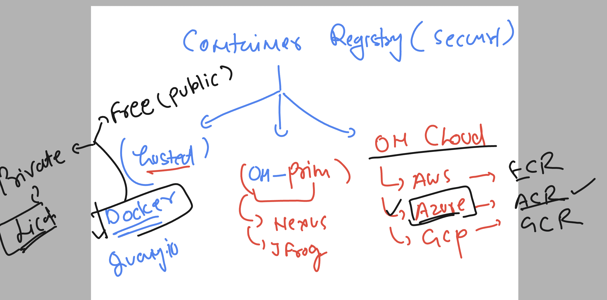
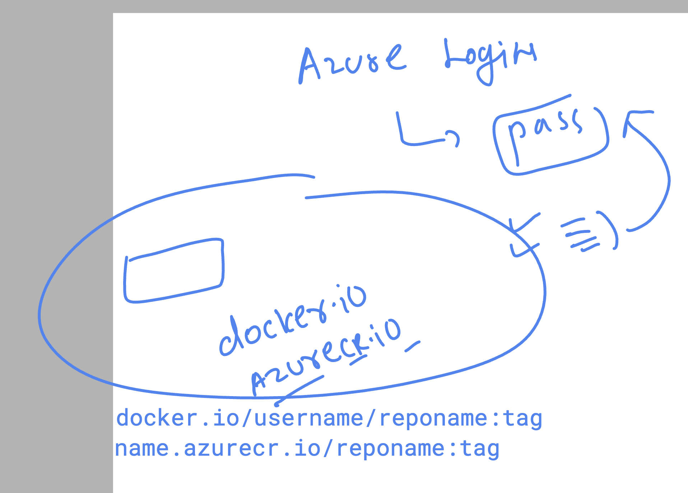
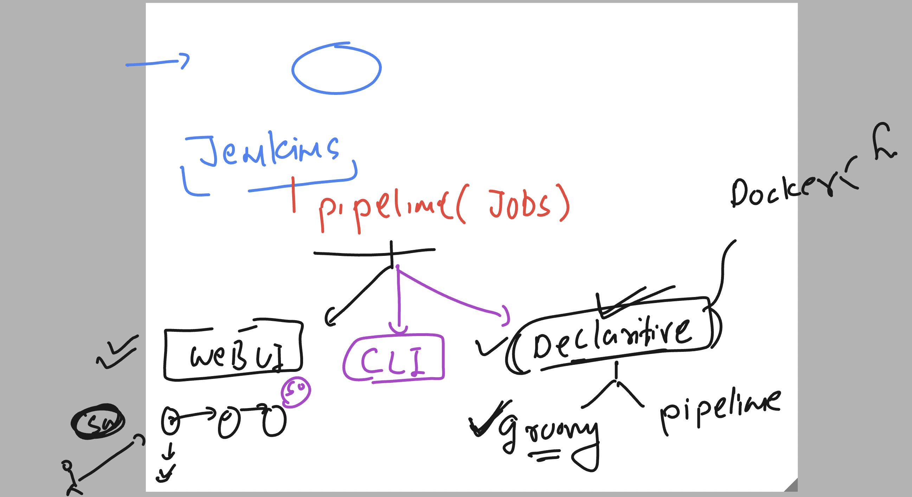
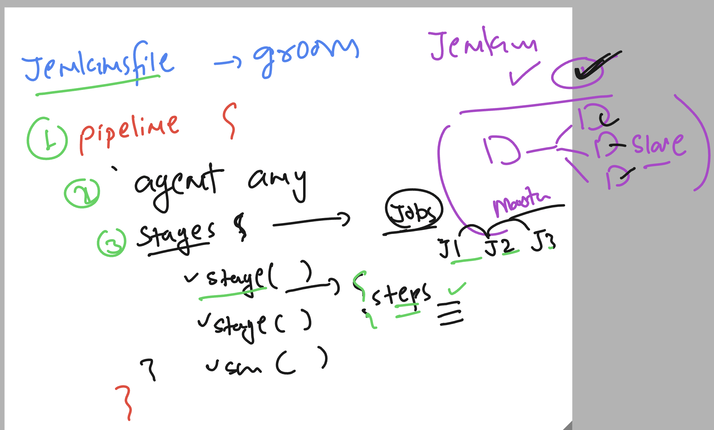
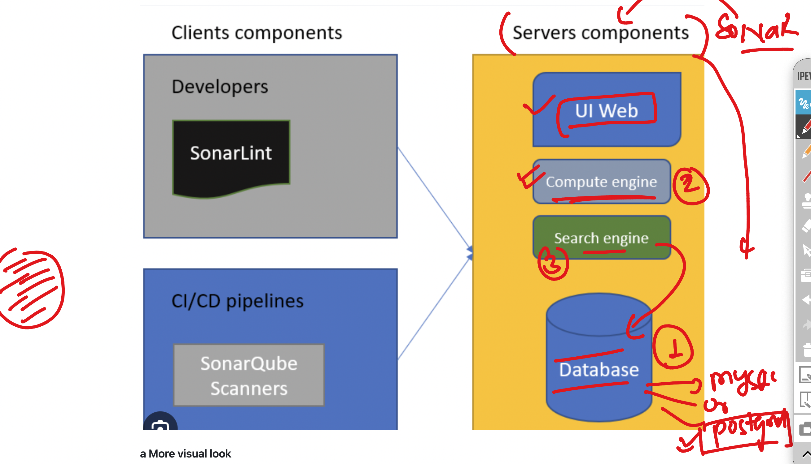
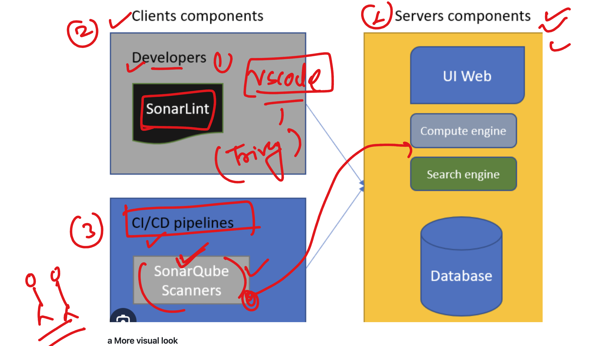
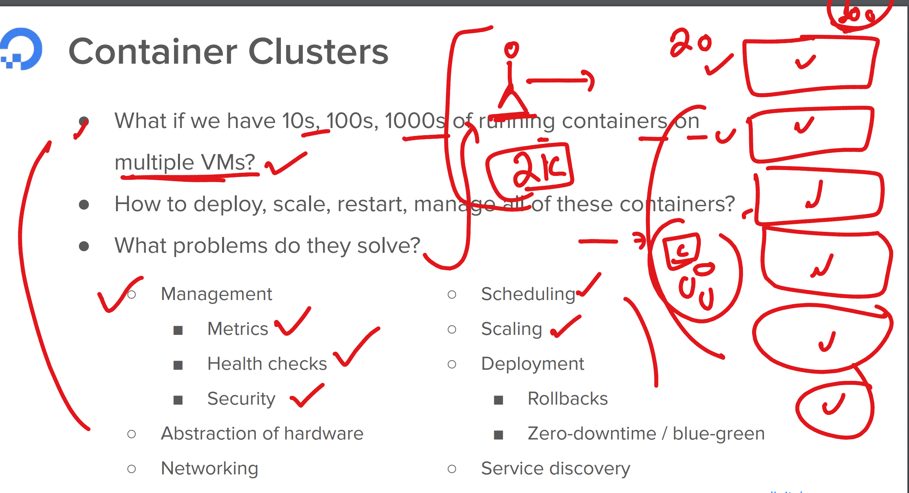

## Container registry 



### azure registry image name format 



## pushing steps image to ACR 

### step 1 -- (changing image format name)

```
[ashu@ip-172-31-29-58 ashu-devsecops]$ docker  images  | grep ashu
ashuflask                              webappv1      0caa406fd31a   19 hours ago   315MB
dockerashu/ashureponew                 appv1         4c2b7fb4d6cd   19 hours ago   315MB
dockerashu/ashureponew                 latest        4c2b7fb4d6cd   19 hours ago   315MB
dockerashu/unisysflask                 appversion1   4c2b7fb4d6cd   19 hours ago   315MB
dockerashu/unisysflask                 latest        4c2b7fb4d6cd   19 hours ago   315MB
ashu-flask                             uniappv1      b35355eb36d0   2 days ago     137MB
ashualp                                pycodev1      77893d4d694e   2 days ago     76.8MB
ashuflask                              appv2         0baae1267e36   2 days ago     137MB

[ashu@ip-172-31-29-58 ashu-devsecops]$ 
[ashu@ip-172-31-29-58 ashu-devsecops]$ docker  tag  ashuflask:webappv1   ashutoshh.azurecr.io/ashupython:flaskappv1 

[ashu@ip-172-31-29-58 ashu-devsecops]$ docker  images  | grep ashu
dockerashu/ashureponew                 appv1         4c2b7fb4d6cd   19 hours ago   315MB
dockerashu/ashureponew                 latest        4c2b7fb4d6cd   19 hours ago   315MB
dockerashu/unisysflask                 appversion1   4c2b7fb4d6cd   19 hours ago   315MB
dockerashu/unisysflask                 latest        4c2b7fb4d6cd   19 hours ago   315MB
ashutoshh.azurecr.io/ashupython        flaskappv1    0caa406fd31a   19 hours ago   315MB
ashuflask                              webappv1      0caa406fd31a   19 hours ago   315MB
ashu-flask                             uniappv1      b35355eb36d0   2 days ago     137MB
ashualp                                pycodev1      77893d4d694e   2 days ago     76.8MB
ashuflask                              appv2         0baae1267e36   2 days ago     137MB

```

### login to azure cr 

```
docker  login  ashutoshh.azurecr.io 
Username: ashutoshh
Password: 
WARNING! Your password will be stored unencrypted in /home/ashu/.docker/config.json.
Configure a credential helper to remove this warning. See
https://docs.docker.com/engine/reference/commandline/login/#credentials-store

Login Succeeded
```

## pushing image to acr 

```
[ashu@ip-172-31-29-58 ashu-devsecops]$ docker  push  ashutoshh.azurecr.io/ashupython:flaskappv1 
The push refers to repository [ashutoshh.azurecr.io/ashupython]
4f4f0822b7d2: Pushed 
86f74cd5dba3: Pushing [=====================>                             ]  82.89MB/189.5MB
d5b86f4bbdcc: Pushed 
301cbbfbd840: Pushed 
9e599118e168: Pushed 
```

## Introduction to jenkins declearative method using jenkinsfile 



### jenkinsfile syntax understanding 



## jenkins file demo 

### demo 1 

```
pipeline {
    agent any

    stages {
        stage('fetching github code') {
            steps {
                // using echo to print message 
                echo 'we are now fetching github code in below'
                // using git to download git repo 
                git branch: 'master', url: 'https://github.com/redashu/ashu_unisys_flaskMysql.git'
                // using sh command to run some commands
                sh 'ls '
            }
        }
    }
}

```

## Introduction to sonarqube 



### more info about sonarqube 



### scanning local code using sonar-scanner 

```
/opt/sonar/bin/sonar-scanner  -Dsonar.projectKey=ashutoshh-project1  -Dsonar.sources=. -Dsonar.host.url=http://3.228.109.178:9000  -Dsonartoken=sqp_06c90c72790a1c0532fb814032389ce055fe98a9

09:35:18.086 INFO  Scanner configuration file: /opt/sonar/conf/sonar-scanner.properties
09:35:18.090 INFO  Project root configuration file: NONE
09:35:18.107 INFO  SonarScanner CLI 6.2.1.4610
09:35:18.109 INFO  Java 17.0.12 Eclipse Adoptium (64-bit)
09:35:18.110 INFO  Linux 6.1.109-118.189.amzn2023.x86_64 amd64

```

### COntaienr problem 




