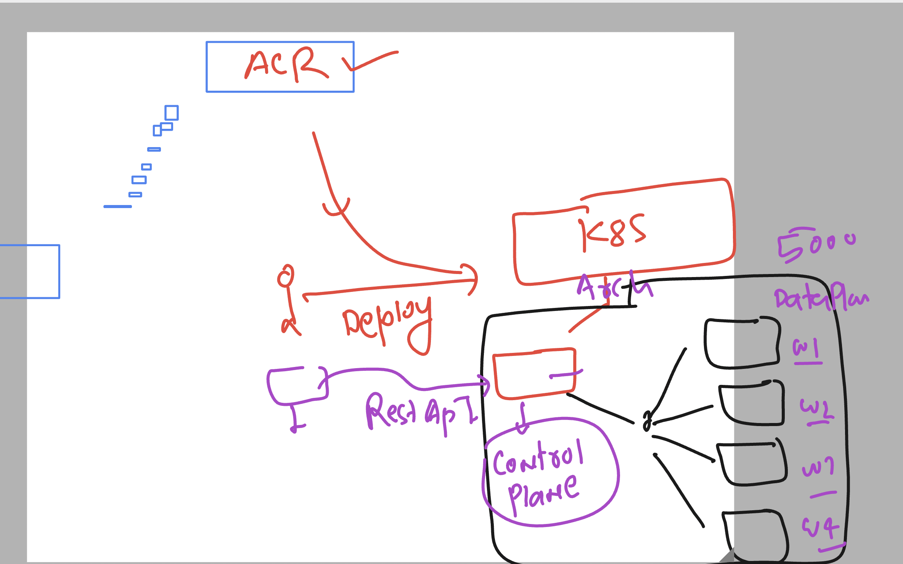
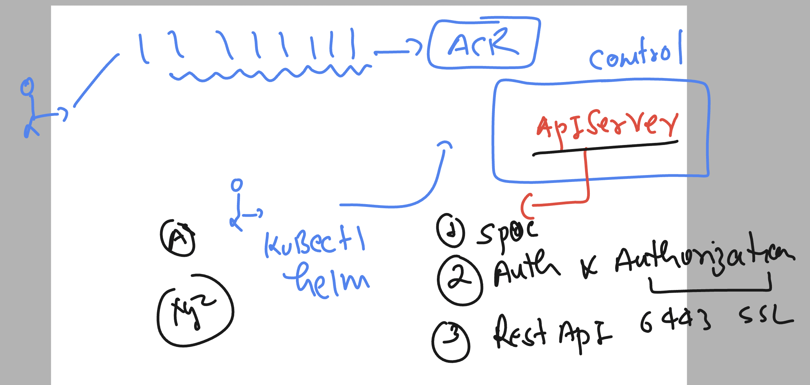
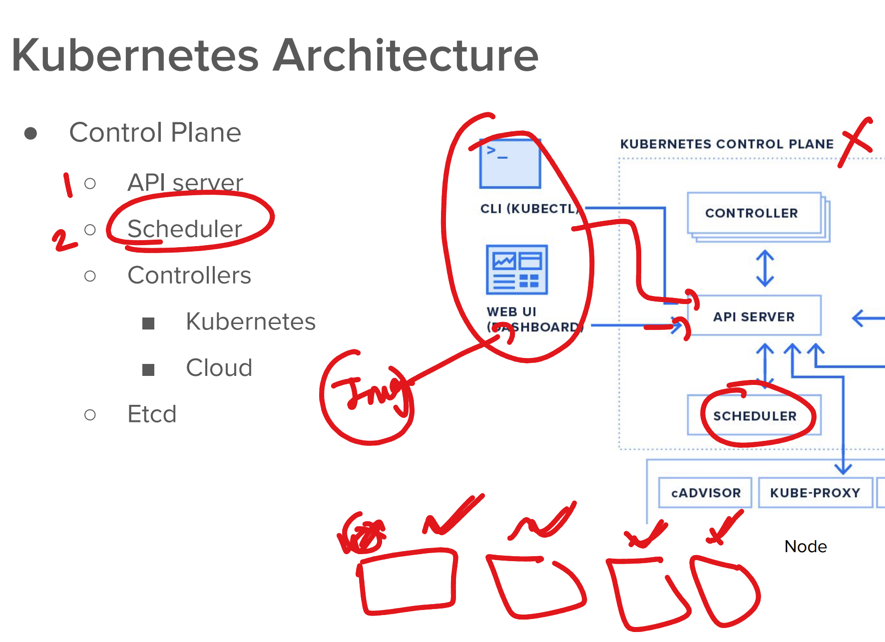
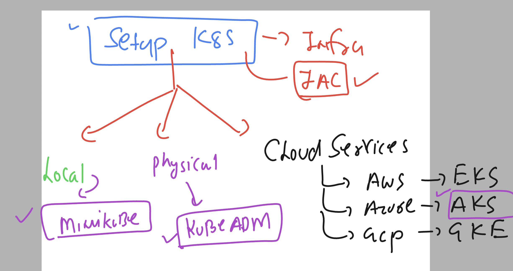
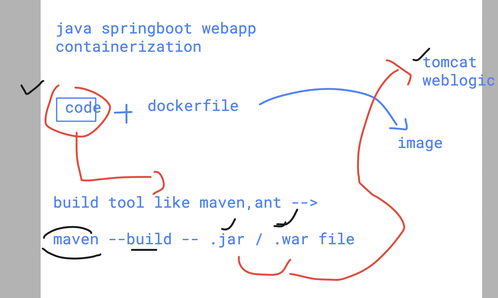

## Container registry 


### azure registry image name format 


## pushing steps image to ACR 

### step 1 -- (changing image format name)

```
[ashu@ip-172-31-29-58 ashu-devsecops]$ docker  images  | grep ashu
ashuflask                              webappv1      0caa406fd31a   19 hours ago   315MB
dockerashu/ashureponew                 appv1         4c2b7fb4d6cd   19 hours ago   315MB
dockerashu/ashureponew                 latest        4c2b7fb4d6cd   19 hours ago   315MB
dockerashu/unisysflask                 appversion1   4c2b7fb4d6cd   19 hours ago   315MB
dockerashu/unisysflask                 latest        4c2b7fb4d6cd   19 hours ago   315MB
ashu-flask                             uniappv1      b35355eb36d0   2 days ago     137MB
ashualp                                pycodev1      77893d4d694e   2 days ago     76.8MB
ashuflask                              appv2         0baae1267e36   2 days ago     137MB

[ashu@ip-172-31-29-58 ashu-devsecops]$ 
[ashu@ip-172-31-29-58 ashu-devsecops]$ docker  tag  ashuflask:webappv1   ashutoshh.azurecr.io/ashupython:flaskappv1 

[ashu@ip-172-31-29-58 ashu-devsecops]$ docker  images  | grep ashu
dockerashu/ashureponew                 appv1         4c2b7fb4d6cd   19 hours ago   315MB
dockerashu/ashureponew                 latest        4c2b7fb4d6cd   19 hours ago   315MB
dockerashu/unisysflask                 appversion1   4c2b7fb4d6cd   19 hours ago   315MB
dockerashu/unisysflask                 latest        4c2b7fb4d6cd   19 hours ago   315MB
ashutoshh.azurecr.io/ashupython        flaskappv1    0caa406fd31a   19 hours ago   315MB
ashuflask                              webappv1      0caa406fd31a   19 hours ago   315MB
ashu-flask                             uniappv1      b35355eb36d0   2 days ago     137MB
ashualp                                pycodev1      77893d4d694e   2 days ago     76.8MB
ashuflask                              appv2         0baae1267e36   2 days ago     137MB

```

### login to azure cr 

```
docker  login  ashutoshh.azurecr.io 
Username: ashutoshh
Password: 
WARNING! Your password will be stored unencrypted in /home/ashu/.docker/config.json.
Configure a credential helper to remove this warning. See
https://docs.docker.com/engine/reference/commandline/login/#credentials-store

Login Succeeded
```

## pushing image to acr 

```
[ashu@ip-172-31-29-58 ashu-devsecops]$ docker  push  ashutoshh.azurecr.io/ashupython:flaskappv1 
The push refers to repository [ashutoshh.azurecr.io/ashupython]
4f4f0822b7d2: Pushed 
86f74cd5dba3: Pushing [=====================>                             ]  82.89MB/189.5MB
d5b86f4bbdcc: Pushed 
301cbbfbd840: Pushed 
9e599118e168: Pushed 
```

## Introduction to jenkins declearative method using jenkinsfile 


### jenkinsfile syntax understanding 


## jenkins file demo 

### demo 1 

```
pipeline {
    agent any

    stages {
        stage('fetching github code') {
            steps {
                // using echo to print message 
                echo 'we are now fetching github code in below'
                // using git to download git repo 
                git branch: 'master', url: 'https://github.com/redashu/ashu_unisys_flaskMysql.git'
                // using sh command to run some commands
                sh 'ls '
            }
        }
    }
}

```

## Introduction to sonarqube 


### more info about sonarqube 


### scanning local code using sonar-scanner 

```
/opt/sonar/bin/sonar-scanner  -Dsonar.projectKey=ashutoshh-project1  -Dsonar.sources=. -Dsonar.host.url=http://3.228.109.178:9000  -Dsonartoken=sqp_06c90c72790a1c0532fb814032389ce055fe98a9

09:35:18.086 INFO  Scanner configuration file: /opt/sonar/conf/sonar-scanner.properties
09:35:18.090 INFO  Project root configuration file: NONE
09:35:18.107 INFO  SonarScanner CLI 6.2.1.4610
09:35:18.109 INFO  Java 17.0.12 Eclipse Adoptium (64-bit)
09:35:18.110 INFO  Linux 6.1.109-118.189.amzn2023.x86_64 amd64

```

### COntaienr problem 


## Introduction to k8s platform 



### k8s control plane component 



### apiserver and schedular on control plane 



## setup of k8s infra 




### installing kubectl on jump server 

```
 curl -LO https://dl.k8s.io/release/v1.31.0/bin/linux/amd64/kubectl
  % Total    % Received % Xferd  Average Speed   Time    Time     Time  Current
                                 Dload  Upload   Total   Spent    Left  Speed
100   138  100   138    0     0   1830      0 --:--:-- --:--:-- --:--:--  1840
100 53.7M  100 53.7M    0     0  90.2M      0 --:--:-- --:--:-- --:--:-- 90.2M
[root@ip-172-31-29-58 sonar]# ls
bin  conf  jre  kubectl  lib
[root@ip-172-31-29-58 sonar]# mv kubectl  /usr/bin/
[root@ip-172-31-29-58 sonar]# chmod +x /usr/bin/kubectl 
[root@ip-172-31-29-58 sonar]# 
[root@ip-172-31-29-58 sonar]# kubectl version --client 
Client Version: v1.31.0
Kustomize Version: v5.4.2
[root@ip-172-31-29-58 sonar]# 

===>
kubectl  version --client  -o yaml 
clientVersion:
  buildDate: "2024-08-13T07:37:34Z"
  compiler: gc
  gitCommit: 9edcffcde5595e8a5b1a35f88c421764e575afce
  gitTreeState: clean
  gitVersion: v1.31.0
  goVersion: go1.22.5
  major: "1"
  minor: "31"
  platform: linux/amd64
kustomizeVersion: v5.4.2
```
## Basic view of java based webap 



## cloning sample java webapp 

```
git clone https://github.com/redashu/java-springboot.git
Cloning into 'java-springboot'...
remote: Enumerating objects: 33, done.
remote: Counting objects: 100% (9/9), done.
remote: Compressing objects: 100% (9/9), done.
remote: Total 33 (delta 3), reused 0 (delta 0), pack-reused 24 (from 1)
Receiving objects: 100% (33/33), 8.48 KiB | 8.48 MiB/s, done.
Resolving deltas: 100% (5/5), done.
[ashu@ip-172-31-29-58 ashu-devsecops]$ ls
ashu-java-webapp  ashu-python-webapp  ashu_unisys_flaskMysql  java-springboot  unisys_devsecops
[ashu@ip-172-31-29-58 ashu-devsecops]$ 

```

### creating oraclelinux container for testing java and maven 

```
docker pull oraclelinux:9
9-slim: Pulling from library/oraclelinux
eba3c26198b7: Already exists 
Digest: sha256:0eb8e1dc0a6144a15926f483a8a0f7c91fc7689fc3a101e348c497a9dbf3488e
Status: Downloaded newer image for oraclelinux:9
docker.io/library/oraclelinux:9
[ashu@ip-172-31-29-58 ashu-devsecops]$ docker images  | grep oracle
oraclelinux                                        9-slim          48240b324564   13 days ago         113MB
[ashu@ip-172-31-29-58 ashu-devsecops]$ 
[ashu@ip-172-31-29-58 ashu-devsecops]$ docker  run -itd --name ashujavac1 oraclelinux:9
b96ab0ddca2a08fabc358399702f2602509c6af5bcd9511f7c3107e3d46b0c55
[ashu@ip-172-31-29-58 ashu-devsecops]$ 
[ashu@ip-172-31-29-58 ashu-devsecops]$ docker  exec  -it  ashujavac1  bash 
bash-5.1# 
bash-5.1# whoami
root
bash-5.1# 

dnf install java-17-openjdk  java-17-openjdk-devel
dnf install maven 
```
