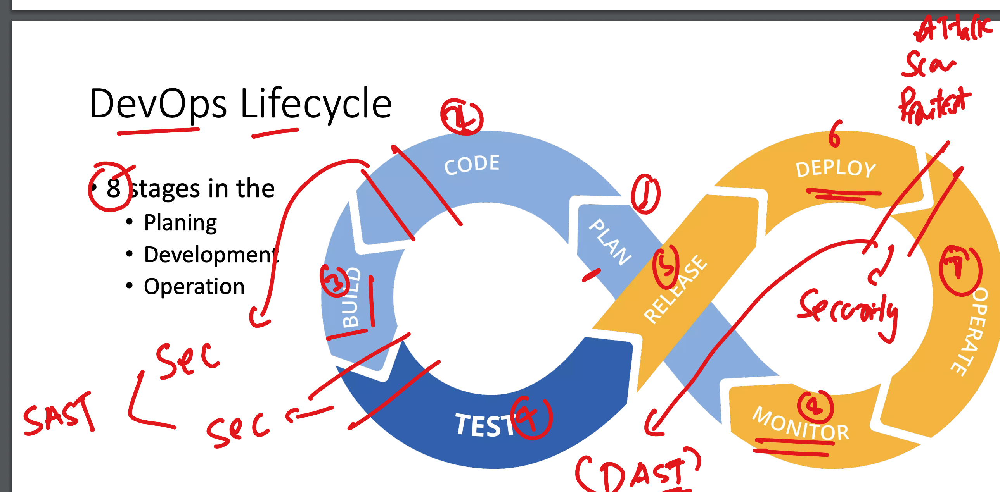
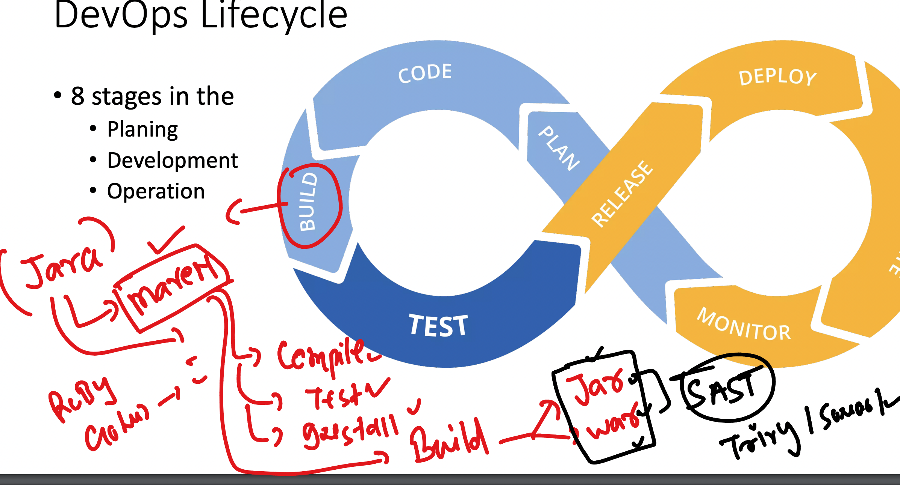
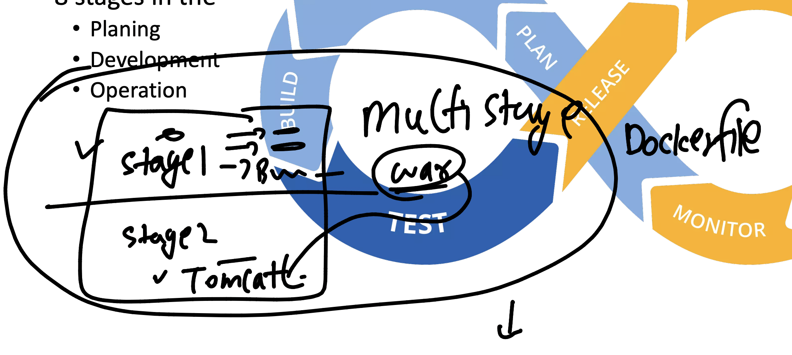

# Understanding lifecyle of Devops -> Devsecops 



## Java based app build and test using maven 



## ON vm lets build java code with maven 

```
git clone https://github.com/redashu/java-springboot.git
Cloning into 'java-springboot'...
remote: Enumerating objects: 33, done.
remote: Counting objects: 100% (9/9), done.
remote: Compressing objects: 100% (9/9), done.
remote: Total 33 (delta 3), reused 0 (delta 0), pack-reused 24 (from 1)
Receiving objects: 100% (33/33), 8.48 KiB | 8.48 MiB/s, done.
Resolving deltas: 100% (5/5), done.
[ashu@ip-172-31-29-58 ashu-devsecops]$ ls
ashu-java-webapp  ashu-python-webapp  ashu_unisys_flaskMysql  java-springboot  unisys_devsecops
[ashu@ip-172-31-29-58 ashu-devsecops]$ 

```

## building it 

### install jdk11 or later if not present 

```
yum install java-11* 

===> verify 
java --version 
openjdk 11.0.24 2024-07-16 LTS
OpenJDK Runtime Environment Corretto-11.0.24.8.1 (build 11.0.24+8-LTS)
OpenJDK 64-Bit Server VM Corretto-11.0.24.8.1 (build 11.0.24+8-LTS, mixed mode)
[ashu@ip-172-31-29-58 java-springboot]$ 

===> Installing maven 

yum install maven -y

===> verify 
ashu@ip-172-31-29-58 java-springboot]$ mvn -v
Apache Maven 3.8.4 (Red Hat 3.8.4-3.amzn2023.0.5)
Maven home: /usr/share/maven
Java version: 17.0.12, vendor: Amazon.com Inc., runtime: /usr/lib/jvm/java-17-amazon-corretto.x86_64
Default locale: en, platform encoding: UTF-8
OS name: "linux", version: "6.1.109-118.189.amzn2023.x86_64", arch: "amd64", family: "unix"
[ashu@ip-172-31-29-58 java-springboot]$ 

===> build it 

 mvn clean package
```

### doing in container 

```
docker build -t ashujava:mvnb1 . 

[ashu@ip-172-31-29-58 java-springboot]$ docker run -it --rm  ashujava:mvnb1  bash 
[root@e4e6f2a15ba9 java-springboot]# ls
Dockerfile  README.md  pom.xml  src  target
[root@e4e6f2a15ba9 java-springboot]# ls target/
WebApp  WebApp.war  maven-archiver
[root@e4e6f2a15ba9 java-springboot]# 

```


### to deploy war file we need tomcat like app server 

### using multi stage dockerfile concept 



### building multistage image and do the contaioner create and test

```
docker build -t ashujava:tomcatapp1 . 
[+] Building 0.4s (15/15) FINISHED                                                                             docker:ashu-remote
 => [internal] load build definition from Dockerfile                                                                         0.0s
 => => transferring dockerfile: 585B                                                                                         0.0s
 => [internal] load metadata for docker.io/library/tomcat:latest                                                             0.0s
 => [internal] load metadata for docker.io/library/oraclelinux:8.4                                                           0.2s
 => [auth] library/oraclelinux:pull token for registry-1.docker.io                                                           0.0s
 => [internal] load .dockerignore                                                                                            0.0s
 => => transferring context: 2B                                                                                              0.0s
 => [warfilebuilder 1/7] FROM docker.io/library/oraclelinux:8.4@sha256:b81d5b0638bb67030b207d28586d0e714a811cc612396dbe3410  0.0s
 => [stage-1 1/2] FROM docker.io/library/tomcat:latest                                                                       0.1s
 => CACHED [warfilebuilder 2/7] RUN dnf install java-1.8.0-openjdk.x86_64  java-1.8.0-openjdk-devel.x86_64  maven git -y     0.0s
 => CACHED [warfilebuilder 3/7] RUN mkdir /ashu-java                                                                         0.0s
 => CACHED [warfilebuilder 4/7] WORKDIR /ashu-java                                                                           0.0s
 => CACHED [warfilebuilder 5/7] RUN git clone https://github.com/redashu/java-springboot.git                                 0.0s
 => CACHED [warfilebuilder 6/7] WORKDIR java-springboot                                                                      0.0s
 => CACHED [warfilebuilder 7/7] RUN mvn clean package                                                                        0.0s
 => [stage-1 2/2] COPY --from=WarfileBuilder /ashu-java/java-springboot/target/WebApp.war /usr/local/tomcat/webapps/         0.0s
 => exporting to image                                                                                                       0.0s
 => => exporting layers                                                                                                      0.0s
 => => writing image sha256:75a6c6a6cb88ae47272617aabf09e5808e32ee7425a6fc3e6ae9fa47f91cf848                                 0.0s
 => => naming to docker.io/library/ashujava:tomcatapp1                                                                       0.0s
[ashu@ip-172-31-29-58 java-springboot]$ docker run -itd --name ashuc1 -p 3001:8080 ashujava:tomcatapp1
daff30e90e76a21b70f4ec0162b05072c4fede7d116be0403016df956459461a
[ashu@ip-172-31-29-58 java-springboot]$ 

```

### pushing this image to container registry of azure 

```
docker images  | grep ashu 
ashujava                                           tomcatapp1      75a6c6a6cb88   19 minutes ago   462MB
ashujava                                           mvnb1           28f2cb1607ee   36 minutes ago   958MB
dockerashu/flaskday4                               appversion1     c343d8b22c17   5 days ago       315MB
registry.hub.docker.com/dockerashu/flaskday4       appversion1     c343d8b22c17   5 days ago       315MB
ashuflask                                          webappv1        dc988b9ac1d0   5 days ago       315MB
dockerashu/flaskday4                               appversion11    29524c8b653e   5 days ago       315MB
registry.hub.docker.com/dockerashu/flaskday4       appversion11    29524c8b653e   5 days ago       315MB
ashutoshh.azurecr.io/ashupython                    flaskappv1      0caa406fd31a   6 days ago       315MB
dockerashu/ashureponew                             appv1           4c2b7fb4d6cd   6 days ago       315MB
dockerashu/ashureponew                             latest          4c2b7fb4d6cd   6 days ago       315MB
dockerashu/unisysflask                             appversion1     4c2b7fb4d6cd   6 days ago       315MB
dockerashu/unisysflask                             latest          4c2b7fb4d6cd   6 days ago       315MB
registry.hub.docker.com/dockerashu/flaskday4       <none>          4c2b7fb4d6cd   6 days ago       315MB
ashu-flask                                         uniappv1        b35355eb36d0   8 days ago       137MB
ashualp                                            pycodev1        77893d4d694e   8 days ago       76.8MB
ashuflask                                          appv2           0baae1267e36   8 days ago       137MB
[ashu@ip-172-31-29-58 java-springboot]$ docker  tag  ashujava:tomcatapp1  ashutoshh.azurecr.io/ashujava:tomcatapp1
[ashu@ip-172-31-29-58 java-springboot]$ docker login ashutoshh.azurecr.io
Authenticating with existing credentials...
WARNING! Your password will be stored unencrypted in /home/ashu/.docker/config.json.
Configure a credential helper to remove this warning. See
https://docs.docker.com/engine/reference/commandline/login/#credentials-store

Login Succeeded
[ashu@ip-172-31-29-58 java-springboot]$ docker push ashutoshh.azurecr.io/ashujava:tomcatapp1
The push refers to repository [ashutoshh.azurecr.io/ashujava]
bb1ed3edbbba: Pushed 
5f70bf18a086: Pushed 
96b023633e9c: Pushed 

```